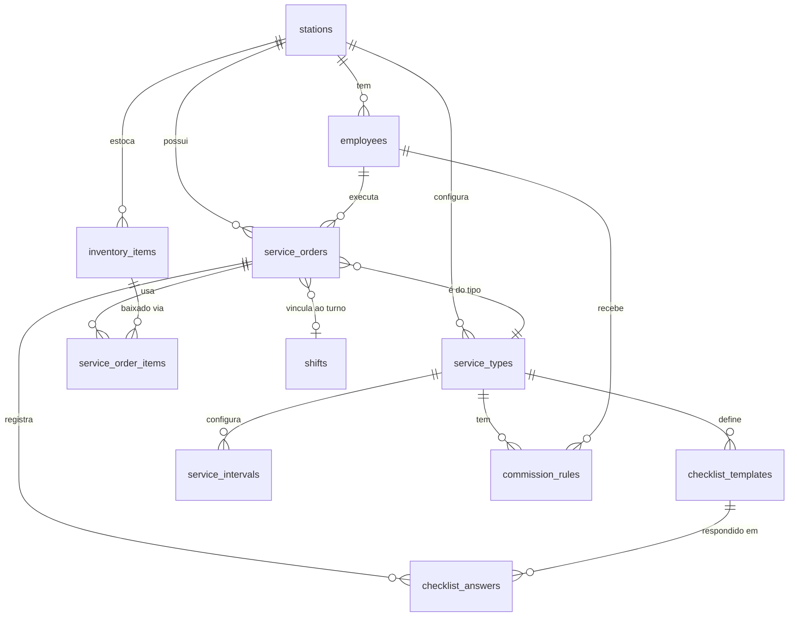

# Octane — Centro de Serviços: Design Spec

**Data:** 2026-06-14
**Escopo:** Módulo completo de gestão de Ordens de Serviço para troca de óleo, lava-rápido e revisão — incluindo histórico do veículo por placa, estoque simples de produtos/peças e comissão de funcionários integrada ao fechamento de turno.

---

## 1. Visão Geral

### Problema

Postos que operam centro de serviços (troca de óleo, lava-rápido, revisão) gerenciam OS em papel ou planilhas desconexas do sistema de abastecimento. Isso gera três perdas concretas:

1. **Receita recorrente não capturada** — sem histórico por placa, o atendente não sabe avisar o cliente que a troca de óleo está vencida por km ou tempo.
2. **Estoque descontrolado** — produtos e peças baixados manualmente, sujeitos a desvio e ruptura.
3. **Comissão litigiosa** — cálculo manual de comissão por serviço gera conflito e desconfiança.

### Solução

O módulo Centro de Serviços introduz a **Ordem de Serviço (OS) Digital** como entidade central. Uma OS registra o serviço prestado, os produtos utilizados, o responsável e o veículo atendido. O sistema calcula comissão automaticamente ao encerrar a OS e alerta sobre intervalos vencidos na próxima visita do veículo.

### Usuários

| Perfil | Uso principal |
|---|---|
| Atendente / Mecânico | Abre, preenche checklist, adiciona produtos, encerra OS |
| Gerente / Dono | Configura tipos de serviço, checklists, intervalos, comissões; consulta relatórios |
| Frentista | Consulta histórico de placa ao abrir OS |

---

## 2. Modelo de Domínio

### Diagrama



### Entidades

#### ServiceType (Tipo de Serviço)
Configurável por posto. Exemplos: "Troca de Óleo", "Lava-Rápido", "Revisão Completa".

| Campo | Tipo | Descrição |
|---|---|---|
| id | UUID | PK |
| station_id | UUID | FK stations |
| name | VARCHAR(100) | Ex.: "Troca de Óleo 5W30" |
| base_labor_price | NUMERIC(10,2) | Preço base da mão de obra |
| active | BOOLEAN | |
| created_at | TIMESTAMP | |
| updated_at | TIMESTAMP | |

#### ChecklistTemplate (Template de Checklist)
Itens de verificação por tipo de serviço.

| Campo | Tipo | Descrição |
|---|---|---|
| id | UUID | PK |
| service_type_id | UUID | FK service_types |
| description | VARCHAR(200) | Ex.: "Verificar nível do fluido de freio" |
| required | BOOLEAN | Se obrigatório para encerrar a OS |
| sort_order | INTEGER | Ordem de exibição |

#### ServiceInterval (Intervalo de Serviço)
Define quando o próximo serviço é recomendado — base para alertas automáticos.

| Campo | Tipo | Descrição |
|---|---|---|
| id | UUID | PK |
| service_type_id | UUID | FK service_types |
| interval_km | INTEGER | Ex.: 5000 (nulo = sem alerta por km) |
| interval_days | INTEGER | Ex.: 180 (nulo = sem alerta por tempo) |

#### Employee (Funcionário)
Funcionários do posto que executam serviços e recebem comissão.

| Campo | Tipo | Descrição |
|---|---|---|
| id | UUID | PK |
| station_id | UUID | FK stations |
| name | VARCHAR(100) | |
| role | VARCHAR(50) | Ex.: "Mecânico", "Lavador" |
| active | BOOLEAN | |
| created_at | TIMESTAMP | |

#### CommissionRule (Regra de Comissão)
Percentual de comissão de um funcionário para um tipo de serviço.

| Campo | Tipo | Descrição |
|---|---|---|
| id | UUID | PK |
| employee_id | UUID | FK employees |
| service_type_id | UUID | FK service_types |
| percentage | NUMERIC(5,2) | Ex.: 10.00 (%) |
| active | BOOLEAN | |
| created_at | TIMESTAMP | |
| UNIQUE | (employee_id, service_type_id) | Uma regra por par |

#### ServiceOrder (Ordem de Serviço)
Entidade central do módulo.

| Campo | Tipo | Descrição |
|---|---|---|
| id | UUID | PK |
| station_id | UUID | FK stations |
| shift_id | UUID | FK shifts (nullable — OS pode existir fora de turno de pista) |
| service_type_id | UUID | FK service_types |
| employee_id | UUID | FK employees |
| vehicle_plate | VARCHAR(10) | Placa no formato Mercosul ou antigo |
| vehicle_mileage | INTEGER | Hodômetro no momento da abertura |
| status | VARCHAR(20) | ABERTA / EM_EXECUCAO / CONCLUIDA / CANCELADA |
| labor_price | NUMERIC(10,2) | Mão de obra cobrada (pode diferir do base_labor_price) |
| total_amount | NUMERIC(12,2) | labor_price + soma dos itens (calculado ao encerrar) |
| commission_amount | NUMERIC(10,2) | Comissão calculada ao encerrar (nullable) |
| notes | VARCHAR(500) | Observações gerais |
| opened_at | TIMESTAMP | |
| closed_at | TIMESTAMP | nullable |
| created_at | TIMESTAMP | |
| updated_at | TIMESTAMP | |

#### ServiceOrderItem (Item da OS — produto/peça)

| Campo | Tipo | Descrição |
|---|---|---|
| id | UUID | PK |
| service_order_id | UUID | FK service_orders |
| inventory_item_id | UUID | FK inventory_items (nullable para itens avulsos) |
| description | VARCHAR(200) | Nome do produto/peça |
| quantity | NUMERIC(10,3) | Quantidade utilizada |
| unit_price | NUMERIC(10,4) | Preço unitário no momento da OS |
| total_price | NUMERIC(12,2) | quantity × unit_price |
| created_at | TIMESTAMP | |

#### ChecklistAnswer (Respostas do Checklist)

| Campo | Tipo | Descrição |
|---|---|---|
| id | UUID | PK |
| service_order_id | UUID | FK service_orders |
| checklist_template_id | UUID | FK checklist_templates |
| checked | BOOLEAN | |
| note | VARCHAR(300) | Observação opcional por item |

#### InventoryItem (Item de Estoque Simples)

| Campo | Tipo | Descrição |
|---|---|---|
| id | UUID | PK |
| station_id | UUID | FK stations |
| name | VARCHAR(150) | Ex.: "Óleo 5W30 1L" |
| unit | VARCHAR(20) | Ex.: "L", "UN", "KG" |
| quantity_in_stock | NUMERIC(10,3) | Quantidade atual |
| unit_cost | NUMERIC(10,4) | Custo unitário (para cálculo de margem) |
| sale_price | NUMERIC(10,4) | Preço de venda padrão |
| low_stock_threshold | NUMERIC(10,3) | Alerta quando quantidade cai abaixo |
| active | BOOLEAN | |
| created_at | TIMESTAMP | |
| updated_at | TIMESTAMP | |

---

## 3. Use Cases

### 3.1 ConfigureServiceType
**Ator:** Gerente

**Entrada:**
```java
record ConfigureServiceTypeRequest(
    String name,                        // obrigatório, max 100
    BigDecimal baseLaborPrice,          // obrigatório, >= 0
    List<ChecklistItemRequest> checklist,
    Integer intervalKm,                 // nullable
    Integer intervalDays                // nullable
) {}

record ChecklistItemRequest(
    String description,   // max 200
    boolean required,
    int sortOrder
) {}
```

**Saída:** `ServiceTypeResponse`

**Regras:**
- `name` único por posto (case-insensitive).
- Ao atualizar checklist, itens removidos que já têm respostas em OS abertas são preservados (apenas novos itens são adicionados).
- `intervalKm` e `intervalDays` independentes — podem coexistir. O alerta dispara quando qualquer um dos dois é atingido.

---

### 3.2 OpenServiceOrder
**Ator:** Atendente

**Entrada:**
```java
record OpenServiceOrderRequest(
    UUID serviceTypeId,
    UUID employeeId,
    String vehiclePlate,       // obrigatório, regex [A-Z]{3}[0-9]{4} | [A-Z]{3}[0-9][A-Z][0-9]{2}
    Integer vehicleMileage,    // obrigatório, > 0
    BigDecimal laborPrice,     // opcional — usa base_labor_price se ausente
    String notes
) {}
```

**Saída:** `ServiceOrderResponse` com campo `vehicleAlerts: List<VehicleAlert>`

**Regras:**
- Valida que `serviceTypeId` e `employeeId` pertencem ao mesmo `stationId`.
- Status inicial: `ABERTA`.
- `laborPrice` nulo usa `service_types.base_labor_price`.
- Após criar a OS, busca o histórico da placa: para cada tipo de serviço com `ServiceInterval`, verifica se a última OS `CONCLUIDA` daquela placa naquele tipo excede `interval_km` ou `interval_days`. Retorna lista de alertas na resposta — não bloqueia a criação.
- `shift_id` é opcional. Se informado, deve estar `OPEN`.

---

### 3.3 StartServiceOrder
**Ator:** Atendente/Mecânico

**Entrada:** `UUID serviceOrderId`

**Regras:**
- Status deve ser `ABERTA` → muda para `EM_EXECUCAO`.
- Idempotente se já está `EM_EXECUCAO`.

---

### 3.4 AddChecklistAnswer
**Ator:** Atendente/Mecânico

**Entrada:**
```java
record ChecklistAnswerRequest(
    UUID checklistTemplateId,
    boolean checked,
    String note   // nullable, max 300
) {}
```

**Regras:**
- OS deve estar em `ABERTA` ou `EM_EXECUCAO`.
- Upsert: se já existe resposta para o template nessa OS, atualiza. Caso contrário, insere.
- `checklistTemplateId` deve pertencer ao `service_type` da OS.

---

### 3.5 AddServiceOrderItem
**Ator:** Atendente/Mecânico

**Entrada:**
```java
record AddServiceOrderItemRequest(
    UUID inventoryItemId,   // nullable — item avulso sem baixa de estoque
    String description,     // obrigatório se inventoryItemId nulo; auto-preenchido se não nulo
    BigDecimal quantity,    // obrigatório, > 0
    BigDecimal unitPrice    // opcional — usa sale_price do item se não informado
) {}
```

**Regras:**
- OS deve estar em `ABERTA` ou `EM_EXECUCAO`.
- Se `inventoryItemId` informado: valida que o item pertence ao posto e está ativo. `description` e `unitPrice` preenchidos automaticamente. Realiza pré-reserva mental (a baixa real ocorre no `CloseServiceOrder`).
- `quantity` deve ser > 0 e, se vinculado ao estoque, não pode exceder `quantity_in_stock` no momento da adição.
- `total_price = quantity × unitPrice` (arredondado HALF_UP, 2 casas).

---

### 3.6 CloseServiceOrder
**Ator:** Atendente

**Entrada:**
```java
record CloseServiceOrderRequest(
    String notes   // nullable — observação final
) {}
```

**Saída:** `ServiceOrderResponse` com `totalAmount` e `commissionAmount` calculados.

**Regras:**
- Status deve ser `ABERTA` ou `EM_EXECUCAO` → muda para `CONCLUIDA`.
- Valida que todos os itens de checklist com `required = true` foram marcados como `checked = true`. Se não, lança `BusinessException` listando os itens pendentes.
- Calcula `total_amount = labor_price + SUM(service_order_items.total_price)`.
- Calcula comissão: busca `CommissionRule` ativa para o par `(employee_id, service_type_id)`. Se encontrada, `commission_amount = total_amount × (percentage / 100)`. Se não encontrada, `commission_amount = null`.
- Realiza baixa de estoque: para cada item com `inventory_item_id` não nulo, decrementa `inventory_items.quantity_in_stock` em `quantity`. Se estoque insuficiente no momento do encerramento (raro mas possível em concorrência), lança `BusinessException` indicando o item.
- Registra `closed_at = now()`.
- Toda a operação é transacional.

---

### 3.7 CancelServiceOrder
**Ator:** Atendente/Gerente

**Entrada:** `UUID serviceOrderId`, `String reason` (obrigatório)

**Regras:**
- Apenas OS em `ABERTA` ou `EM_EXECUCAO` podem ser canceladas.
- Itens com `inventory_item_id` vinculado **não** estornam estoque (a baixa só ocorre no `CloseServiceOrder`; durante a OS o estoque não foi decrementado).
- Status → `CANCELADA`. `notes` recebe o motivo do cancelamento prefixado com `[CANCELADO] `.
- `closed_at = now()`.

---

### 3.8 GetVehicleHistory
**Ator:** Atendente/Gerente

**Entrada:** `String plate`, `UUID stationId`

**Saída:** lista de `ServiceOrderSummary` ordenada por `opened_at DESC` com alertas calculados.

**Regras:**
- Retorna todas as OS `CONCLUIDA` e `CANCELADA` da placa naquele posto.
- Para cada tipo de serviço com intervalo configurado, calcula e retorna o alerta (km ou dias desde o último serviço).

---

### 3.9 ListInventoryItems / ManageInventoryItem
**Ator:** Gerente

Operações CRUD padrão para o estoque simples:
- Listar itens do posto (filtro por nome, status).
- Criar/atualizar item.
- Ajuste manual de estoque (entrada de mercadoria): incrementa `quantity_in_stock` com log de motivo.
- Ativar/inativar item.

---

### 3.10 GetCommissionReport
**Ator:** Gerente

**Entrada:** `UUID stationId`, `UUID employeeId` (nullable — todos), `LocalDate from`, `LocalDate to`

**Saída:** lista de `CommissionEntry` com total por funcionário.

**Regras:**
- Considera apenas OS `CONCLUIDA` com `commission_amount NOT NULL` no período.
- Agrega por `employee_id`.

---

## 4. API REST

### Base path: `/api`

#### Tipos de Serviço

```
GET    /stations/{stationId}/service-types            → List<ServiceTypeResponse>
POST   /stations/{stationId}/service-types            → ServiceTypeResponse  [201]
GET    /stations/{stationId}/service-types/{id}       → ServiceTypeResponse
PUT    /stations/{stationId}/service-types/{id}       → ServiceTypeResponse
PATCH  /stations/{stationId}/service-types/{id}/status → ServiceTypeResponse
```

#### Funcionários

```
GET    /stations/{stationId}/employees                → List<EmployeeResponse>
POST   /stations/{stationId}/employees                → EmployeeResponse  [201]
PUT    /stations/{stationId}/employees/{id}           → EmployeeResponse
PATCH  /stations/{stationId}/employees/{id}/status    → EmployeeResponse
```

#### Regras de Comissão

```
GET    /employees/{employeeId}/commission-rules       → List<CommissionRuleResponse>
POST   /employees/{employeeId}/commission-rules       → CommissionRuleResponse  [201]
PUT    /employees/{employeeId}/commission-rules/{id}  → CommissionRuleResponse
```

#### Estoque

```
GET    /stations/{stationId}/inventory                → List<InventoryItemResponse>
POST   /stations/{stationId}/inventory                → InventoryItemResponse  [201]
PUT    /stations/{stationId}/inventory/{id}           → InventoryItemResponse
PATCH  /stations/{stationId}/inventory/{id}/status    → InventoryItemResponse
POST   /stations/{stationId}/inventory/{id}/adjust    → InventoryItemResponse
  body: { "delta": 10.0, "reason": "Compra NF 1234" }
```

#### Ordens de Serviço

```
GET    /stations/{stationId}/service-orders           → List<ServiceOrderResponse>
  query: status, employeeId, from, to, plate, page, size
POST   /stations/{stationId}/service-orders           → ServiceOrderResponse  [201]
GET    /stations/{stationId}/service-orders/{id}      → ServiceOrderResponse
POST   /service-orders/{id}/start                     → ServiceOrderResponse
POST   /service-orders/{id}/close                     → ServiceOrderResponse
POST   /service-orders/{id}/cancel                    → ServiceOrderResponse
POST   /service-orders/{id}/items                     → ServiceOrderItemResponse  [201]
DELETE /service-orders/{id}/items/{itemId}            → 204
POST   /service-orders/{id}/checklist                 → ChecklistAnswerResponse  [200/201]
```

#### Histórico do Veículo

```
GET    /stations/{stationId}/vehicles/{plate}/history → VehicleHistoryResponse
```

#### Relatório de Comissões

```
GET    /stations/{stationId}/reports/commissions      → CommissionReportResponse
  query: employeeId (opcional), from, to
```

### Payloads principais (Java Records)

```java
// --- Tipos de Serviço ---
record ServiceTypeResponse(
    UUID id,
    String name,
    BigDecimal baseLaborPrice,
    List<ChecklistTemplateResponse> checklist,
    Integer intervalKm,
    Integer intervalDays,
    boolean active
) {}

record ChecklistTemplateResponse(
    UUID id,
    String description,
    boolean required,
    int sortOrder
) {}

// --- OS ---
record OpenServiceOrderRequest(
    @NotNull UUID serviceTypeId,
    @NotNull UUID employeeId,
    @NotBlank @Pattern(regexp = "[A-Z]{3}[0-9]{4}|[A-Z]{3}[0-9][A-Z][0-9]{2}") String vehiclePlate,
    @NotNull @Positive Integer vehicleMileage,
    @DecimalMin("0.00") BigDecimal laborPrice,
    UUID shiftId,
    @Size(max = 500) String notes
) {}

record ServiceOrderResponse(
    UUID id,
    UUID stationId,
    ServiceTypeSummary serviceType,
    EmployeeSummary employee,
    String vehiclePlate,
    int vehicleMileage,
    String status,
    BigDecimal laborPrice,
    BigDecimal totalAmount,
    BigDecimal commissionAmount,
    String notes,
    LocalDateTime openedAt,
    LocalDateTime closedAt,
    List<ServiceOrderItemResponse> items,
    List<ChecklistAnswerResponse> checklistAnswers,
    List<VehicleAlert> vehicleAlerts   // preenchido apenas na abertura
) {}

record VehicleAlert(
    String serviceTypeName,
    Integer kmSinceLast,
    Integer daysSinceLast,
    Integer intervalKm,
    Integer intervalDays,
    AlertSeverity severity   // INFO, WARNING, OVERDUE
) {}

// --- Itens da OS ---
record AddServiceOrderItemRequest(
    UUID inventoryItemId,
    @Size(max = 200) String description,
    @NotNull @Positive BigDecimal quantity,
    @DecimalMin("0.01") BigDecimal unitPrice
) {}

record ServiceOrderItemResponse(
    UUID id,
    UUID inventoryItemId,
    String description,
    BigDecimal quantity,
    BigDecimal unitPrice,
    BigDecimal totalPrice
) {}

// --- Histórico do Veículo ---
record VehicleHistoryResponse(
    String plate,
    List<ServiceOrderSummary> orders,
    List<VehicleAlert> currentAlerts
) {}

// --- Comissão ---
record CommissionReportResponse(
    LocalDate from,
    LocalDate to,
    List<CommissionEntry> entries,
    BigDecimal grandTotal
) {}

record CommissionEntry(
    UUID employeeId,
    String employeeName,
    int ordersCount,
    BigDecimal totalRevenue,
    BigDecimal totalCommission
) {}
```

---

## 5. Migrações de Banco

As migrations seguem a sequência Flyway existente. O próximo índice disponível é V11.

### V11__create_service_types.sql
```sql
CREATE TABLE service_types (
    id UUID PRIMARY KEY DEFAULT gen_random_uuid(),
    station_id UUID NOT NULL REFERENCES stations(id),
    name VARCHAR(100) NOT NULL,
    base_labor_price NUMERIC(10,2) NOT NULL DEFAULT 0,
    active BOOLEAN NOT NULL DEFAULT TRUE,
    created_at TIMESTAMP NOT NULL DEFAULT NOW(),
    updated_at TIMESTAMP NOT NULL DEFAULT NOW(),
    UNIQUE (station_id, name)
);
```

### V12__create_checklist_templates.sql
```sql
CREATE TABLE checklist_templates (
    id UUID PRIMARY KEY DEFAULT gen_random_uuid(),
    service_type_id UUID NOT NULL REFERENCES service_types(id),
    description VARCHAR(200) NOT NULL,
    required BOOLEAN NOT NULL DEFAULT FALSE,
    sort_order INTEGER NOT NULL DEFAULT 0
);
```

### V13__create_service_intervals.sql
```sql
CREATE TABLE service_intervals (
    id UUID PRIMARY KEY DEFAULT gen_random_uuid(),
    service_type_id UUID NOT NULL REFERENCES service_types(id) UNIQUE,
    interval_km INTEGER,
    interval_days INTEGER,
    CHECK (interval_km IS NOT NULL OR interval_days IS NOT NULL)
);
```

### V14__create_employees.sql
```sql
CREATE TABLE employees (
    id UUID PRIMARY KEY DEFAULT gen_random_uuid(),
    station_id UUID NOT NULL REFERENCES stations(id),
    name VARCHAR(100) NOT NULL,
    role VARCHAR(50),
    active BOOLEAN NOT NULL DEFAULT TRUE,
    created_at TIMESTAMP NOT NULL DEFAULT NOW()
);
```

### V15__create_commission_rules.sql
```sql
CREATE TABLE commission_rules (
    id UUID PRIMARY KEY DEFAULT gen_random_uuid(),
    employee_id UUID NOT NULL REFERENCES employees(id),
    service_type_id UUID NOT NULL REFERENCES service_types(id),
    percentage NUMERIC(5,2) NOT NULL CHECK (percentage >= 0 AND percentage <= 100),
    active BOOLEAN NOT NULL DEFAULT TRUE,
    created_at TIMESTAMP NOT NULL DEFAULT NOW(),
    UNIQUE (employee_id, service_type_id)
);
```

### V16__create_inventory_items.sql
```sql
CREATE TABLE inventory_items (
    id UUID PRIMARY KEY DEFAULT gen_random_uuid(),
    station_id UUID NOT NULL REFERENCES stations(id),
    name VARCHAR(150) NOT NULL,
    unit VARCHAR(20) NOT NULL,
    quantity_in_stock NUMERIC(10,3) NOT NULL DEFAULT 0,
    unit_cost NUMERIC(10,4),
    sale_price NUMERIC(10,4),
    low_stock_threshold NUMERIC(10,3),
    active BOOLEAN NOT NULL DEFAULT TRUE,
    created_at TIMESTAMP NOT NULL DEFAULT NOW(),
    updated_at TIMESTAMP NOT NULL DEFAULT NOW()
);
```

### V17__create_service_orders.sql
```sql
CREATE TABLE service_orders (
    id UUID PRIMARY KEY DEFAULT gen_random_uuid(),
    station_id UUID NOT NULL REFERENCES stations(id),
    shift_id UUID REFERENCES shifts(id),
    service_type_id UUID NOT NULL REFERENCES service_types(id),
    employee_id UUID NOT NULL REFERENCES employees(id),
    vehicle_plate VARCHAR(10) NOT NULL,
    vehicle_mileage INTEGER NOT NULL,
    status VARCHAR(20) NOT NULL DEFAULT 'ABERTA',
    labor_price NUMERIC(10,2) NOT NULL,
    total_amount NUMERIC(12,2),
    commission_amount NUMERIC(10,2),
    notes VARCHAR(500),
    opened_at TIMESTAMP NOT NULL DEFAULT NOW(),
    closed_at TIMESTAMP,
    created_at TIMESTAMP NOT NULL DEFAULT NOW(),
    updated_at TIMESTAMP NOT NULL DEFAULT NOW()
);

CREATE INDEX idx_service_orders_station ON service_orders(station_id);
CREATE INDEX idx_service_orders_plate ON service_orders(vehicle_plate);
CREATE INDEX idx_service_orders_status ON service_orders(status);
CREATE INDEX idx_service_orders_employee ON service_orders(employee_id);
CREATE INDEX idx_service_orders_opened_at ON service_orders(opened_at);
```

### V18__create_service_order_items.sql
```sql
CREATE TABLE service_order_items (
    id UUID PRIMARY KEY DEFAULT gen_random_uuid(),
    service_order_id UUID NOT NULL REFERENCES service_orders(id),
    inventory_item_id UUID REFERENCES inventory_items(id),
    description VARCHAR(200) NOT NULL,
    quantity NUMERIC(10,3) NOT NULL CHECK (quantity > 0),
    unit_price NUMERIC(10,4) NOT NULL CHECK (unit_price >= 0),
    total_price NUMERIC(12,2) NOT NULL,
    created_at TIMESTAMP NOT NULL DEFAULT NOW()
);
```

### V19__create_checklist_answers.sql
```sql
CREATE TABLE checklist_answers (
    id UUID PRIMARY KEY DEFAULT gen_random_uuid(),
    service_order_id UUID NOT NULL REFERENCES service_orders(id),
    checklist_template_id UUID NOT NULL REFERENCES checklist_templates(id),
    checked BOOLEAN NOT NULL DEFAULT FALSE,
    note VARCHAR(300),
    UNIQUE (service_order_id, checklist_template_id)
);
```

---

## 6. Frontend

### 6.1 Estrutura de Arquivos (adições)

```
frontend/src/
├── api/
│   ├── service-types.ts          # CRUD tipos de serviço + checklist
│   ├── employees.ts              # CRUD funcionários + comissões
│   ├── inventory.ts              # CRUD estoque + ajuste
│   └── service-orders.ts        # CRUD OS + items + checklist + start/close/cancel
├── components/
│   └── servicos/
│       ├── ServiceOrderList.tsx        # Tabela de OS com filtros
│       ├── OpenServiceOrderSheet.tsx   # Sheet abertura de OS + alerta de placa
│       ├── ServiceOrderDetail.tsx      # Drawer full com checklist + itens + ações
│       ├── ChecklistPanel.tsx          # Lista de itens com toggle e nota
│       ├── AddItemPanel.tsx            # Busca item do estoque ou adiciona avulso
│       ├── VehicleHistoryModal.tsx     # Histórico da placa
│       ├── CommissionReport.tsx        # Relatório de comissões com filtros
│       ├── InventoryList.tsx           # Tabela de estoque com badge de baixo estoque
│       ├── AdjustStockSheet.tsx        # Sheet entrada de mercadoria
│       └── ConfigServicosPage.tsx      # Configurações: tipos, checklist, intervalos
├── pages/
│   ├── ServicosPage.tsx                # Lista de OS ativas + botão nova OS
│   ├── HistoricoServicosPage.tsx       # Histórico de OS encerradas
│   └── ConfiguracaoServicosPage.tsx    # Tipos de serviço, funcionários, comissões, estoque
```

### 6.2 Rotas

```
/servicos                        → ServicosPage (OS abertas e em execução)
/servicos/historico              → HistoricoServicosPage (CONCLUIDA / CANCELADA)
/servicos/config                 → ConfiguracaoServicosPage
/servicos/config/tipos           → tipos de serviço
/servicos/config/funcionarios    → funcionários e comissões
/servicos/config/estoque         → gestão de estoque
```

Sidebar ganha novo item "Serviços" expansível com sub-itens: OS Ativas / Histórico / Configurações.

### 6.3 Tela: Serviços (OS Ativas)

**Layout:** dois painéis — lista de OS ativas à esquerda (60%) + painel de detalhe à direita (40%) quando uma OS é selecionada.

**Lista de OS (`ServiceOrderList`):**
- Filtros: tipo de serviço, funcionário, status (ABERTA / EM_EXECUCAO).
- Colunas: Placa / Tipo / Funcionário / Status / Abertura / Valor parcial.
- Badge de status com cor: cinza (ABERTA), azul (EM_EXECUCAO).
- Botão "+ Nova OS" → `OpenServiceOrderSheet`.
- `refetchInterval: 30_000` para atualizar automaticamente sem reload.

**`OpenServiceOrderSheet`:**
- Campos: Tipo de serviço (select), Funcionário (select), Placa (input com máscara), Hodômetro, Preço mão de obra (pré-preenchido com `baseLaborPrice`, editável), Notas, Turno (select opcional — turnos abertos do posto).
- Ao informar a placa e perder o foco, dispara `GET /stations/{id}/vehicles/{plate}/history` e exibe os alertas retornados em um banner de aviso colorido (INFO=azul, WARNING=amarelo, OVERDUE=vermelho) antes do botão confirmar.
- POST `/stations/{stationId}/service-orders` → fecha sheet → seleciona a OS criada no detalhe.

**`ServiceOrderDetail` (drawer/painel direito):**
- Header: Placa, Tipo, Funcionário, Status, Hodômetro, botões de ação conforme status:
  - ABERTA: [Iniciar] [Cancelar]
  - EM_EXECUCAO: [Encerrar] [Cancelar]
  - CONCLUIDA/CANCELADA: readonly
- **Aba Checklist:** `ChecklistPanel` — lista todos os itens do template. Toggle checked/unchecked. Campo de nota por item. Itens obrigatórios marcados com asterisco vermelho.
- **Aba Produtos/Peças:** `AddItemPanel` — busca por nome no estoque do posto (autocomplete). Exibe quantidade em estoque. Adiciona com quantidade e preço (pré-preenchidos, editáveis). Lista os itens já adicionados com subtotal e botão remover. Total parcial atualizado em tempo real.
- **Aba Resumo:** Labor + soma dos itens + comissão estimada (se regra existir) + total.
- Encerramento: valida checklist obrigatório no frontend antes de submeter. Se falhar no backend, exibe os itens pendentes em toast de erro.

### 6.4 Tela: Histórico de Serviços

Tabela com filtros: período de datas, placa, tipo, funcionário, status.
Colunas: Placa / Tipo / Funcionário / Abertura / Encerramento / Total / Comissão / Status.
Clicar → `ServiceOrderDetail` em modo readonly com todos os dados.
Botão "Exportar CSV" (reutiliza padrão já existente no projeto).

### 6.5 Tela: Configurações de Serviços

Sub-abas em tabs horizontais:

**Tipos de Serviço:**
- Tabela: Nome / Preço Base / Intervalo km / Intervalo dias / Status.
- Sheet criar/editar: nome, preço base, lista dinâmica de itens de checklist (drag para reordenar, toggle required), intervalos.

**Funcionários:**
- Tabela: Nome / Cargo / Status.
- Sheet criar/editar: nome, cargo.
- Na linha do funcionário, expandir revela tabela de regras de comissão por tipo de serviço com campos editáveis inline.

**Estoque:**
- Tabela: Nome / Unidade / Estoque / Preço de Venda / Status.
- Badge vermelho quando `quantity_in_stock < low_stock_threshold`.
- Sheet criar/editar: todos os campos.
- Botão "Entrada" → `AdjustStockSheet`: quantidade a adicionar + motivo + nota fiscal opcional.

### 6.6 Modal: Histórico do Veículo

Acessível a partir do campo placa na `OpenServiceOrderSheet` (link "Ver histórico completo") e da lista de histórico.
Exibe cronologia de OS encerradas com tipo de serviço, hodômetro, data e valor. Alerta de intervalo no topo se aplicável.

---

## 7. Regras de Negócio Críticas

### 7.1 Placa do Veículo
- Aceita formato antigo (`ABC1234`) e Mercosul (`ABC1D23`). Normalização: sempre uppercase, sem hífen.
- A busca no histórico é case-insensitive via `UPPER(vehicle_plate)`.

### 7.2 Baixa de Estoque — Consistência
- A baixa **só ocorre** no `CloseServiceOrder`, dentro de uma transação.
- Durante a OS (ABERTA/EM_EXECUCAO), o estoque não é decrementado. A reserva é apenas visual (quantidade exibida ao adicionar item).
- Se dois mecânicos adicionarem o mesmo item ao mesmo tempo e o estoque for insuficiente para ambos, o erro ocorre somente no encerramento do segundo. **Decisão explícita:** não implementar reserva pessimista nesta versão (estoque simples, volume baixo de OS simultâneas).
- Cancelamento não estorna estoque (a baixa não foi efetivada).

### 7.3 Comissão
- Calculada sobre o `total_amount` (mão de obra + peças), não apenas sobre a mão de obra. Isso é padrão do mercado (referência: CIGAM ERP).
- Se a regra de comissão for alterada após a abertura mas antes do encerramento da OS, prevalece a regra vigente **no momento do encerramento** (snapshot simples: busca `commission_rules` ativa no `CloseServiceOrder`).
- `commission_amount` é armazenado desnormalizado para garantir imutabilidade histórica. Alterações posteriores na `commission_rules` não retroagem.

### 7.4 Alertas de Intervalo
- `severity = OVERDUE` quando: `km_since_last >= interval_km` OU `days_since_last >= interval_days`.
- `severity = WARNING` quando: `km_since_last >= interval_km * 0.9` OU `days_since_last >= interval_days * 0.9` (dentro dos últimos 10% do intervalo).
- `severity = INFO` nos demais casos com histórico existente.
- Nenhum alerta se não há OS anterior da placa naquele tipo de serviço.

### 7.5 Encerramento com Checklist Incompleto
- Lança `BusinessException` com mensagem listando as `description` dos itens `required` não marcados.
- O frontend valida previamente (client-side via estado local do checklist), mas o backend é a fonte de verdade.

### 7.6 OS e Turno de Pista
- A vinculação ao turno é opcional. Um posto pode ter o módulo de serviços ativo sem turno de pista (ex.: mecânica independente que também vende combustível).
- O relatório de comissões é independente do fechamento de turno mas pode ser consultado filtrado pelo mesmo período.
- **Não** há integração automática entre o `total_amount` da OS e o caixa do turno nesta versão. A receita dos serviços é reportada separadamente.

### 7.7 Itens Avulsos
- Itens sem `inventory_item_id` (avulsos) são permitidos para peças não cadastradas. Não geram movimentação de estoque. `description` é obrigatória nesses casos.

---

## 8. Estratégia de Testes

### 8.1 Use Case (Unitário — JUnit 5 + Mockito)

| Caso | Cobertura |
|---|---|
| `OpenServiceOrderUseCase` | Criação sem histórico, criação com alerta WARNING, criação com alerta OVERDUE |
| `CloseServiceOrderUseCase` | Sucesso, checklist obrigatório incompleto, estoque insuficiente, comissão calculada corretamente, ausência de regra de comissão |
| `CancelServiceOrderUseCase` | Cancelar OS ABERTA, cancelar OS CONCLUIDA (deve falhar) |
| `AddServiceOrderItemUseCase` | Item de estoque válido, item avulso, item sem description avulso (deve falhar) |
| `GetVehicleHistoryUseCase` | Sem histórico, com histórico e intervalo vencido, com histórico e intervalo ok |
| `GetCommissionReportUseCase` | Sem OS no período, com múltiplos funcionários |

### 8.2 Handler (Integração leve — `@WebMvcTest`)

- Validação de `@Pattern` na placa: placa inválida retorna 400.
- `@NotNull` nos campos obrigatórios.
- Conversão de `BusinessException` → 422 (via `GlobalExceptionHandler` existente).

### 8.3 Repositório (Integração — `@DataJpaTest` + Testcontainers PostgreSQL)

- `findLastConcludedByPlateAndType`: verifica ordering por `closed_at DESC` e filtragem por status.
- Concorrência na baixa de estoque: dois enceramentos simultâneos com estoque = quantidade de um → um deve falhar.
- `UNIQUE (employee_id, service_type_id)` em `commission_rules` é respeitado.

### 8.4 Frontend (Vitest + Testing Library)

- `OpenServiceOrderSheet`: ao informar placa com histórico vencido, banner WARNING/OVERDUE aparece.
- `ChecklistPanel`: toggle de item obrigatório; botão "Encerrar" desabilitado se item obrigatório unchecked.
- `ServiceOrderList`: OS com status EM_EXECUCAO exibe badge azul.
- `CommissionReport`: total grand total bate com soma das entradas.

---

## 9. Decisões de Design

### 9.1 OS desacoplada do turno de pista

**Decisão:** `shift_id` é opcional em `service_orders`.

**Motivo:** Um posto pode ter centro de serviços operando sem turno de pista aberto (mecânica sem bombas, ou horários diferentes). Forçar vínculo bloquearia o MVP em postos que abrem a mecânica antes de abrir a pista.

**Alternativa rejeitada:** sempre exigir turno → rigidez desnecessária. A integração financeira turno↔serviços fica para versão futura (módulo de caixa unificado).

### 9.2 Estoque simples sem reserva pessimista

**Decisão:** não há bloqueio de estoque durante a OS; a baixa ocorre somente no encerramento.

**Motivo:** volume de OS simultâneas em um posto é tipicamente baixo (1-3 mecânicos). O custo de implementar reserva (SELECT FOR UPDATE ou tabela de reservas) supera o benefício neste estágio.

**Risco aceito:** dois mecânicos podem somar itens que excedem o estoque físico; o segundo a encerrar receberá erro. Resolução operacional: um deles adiciona item avulso e ajusta o estoque manualmente depois.

**Alternativa futura:** implementar `inventory_reservations` com TTL ao adicionar item, liberando na conclusão/cancelamento.

### 9.3 Comissão sobre total (mão de obra + peças)

**Decisão:** `commission_amount = total_amount × percentage`, onde `total_amount` inclui peças.

**Motivo:** padrão de mercado em centros de serviços de postos (referência: CIGAM ERP, GestãoClick). Mecânico tem incentivo para recomendar a troca preventiva das peças corretas.

**Alternativa rejeitada:** comissão apenas sobre mão de obra → mecânicos têm incentivo para subdeclarar peças e cobrar diretamente do cliente.

**Configuração futura:** o modelo de `CommissionRule` pode ser estendido com um campo `commission_base` (TOTAL / LABOR_ONLY) sem quebrar a estrutura atual.

### 9.4 Alertas como campo calculado na resposta, não armazenado

**Decisão:** alertas de intervalo são calculados on-the-fly em `OpenServiceOrder` e `GetVehicleHistory`, não persistidos.

**Motivo:** a fonte de verdade é o histórico de OS encerradas. Armazenar alertas cria redundância e risco de dessincronia quando intervalos são reconfigurados. O custo de calcular ao abrir uma OS é desprezível (1 query por tipo de serviço).

### 9.5 Nomenclatura em português nos status da OS

**Decisão:** `ABERTA`, `EM_EXECUCAO`, `CONCLUIDA`, `CANCELADA` em vez de `OPEN`, `IN_PROGRESS`, etc.

**Motivo:** O módulo é voltado para uso operacional por atendentes brasileiros. Os status aparecerão nos relatórios e exportações CSV. Manter em português reduz a necessidade de mapeamento de exibição no frontend.

**Consistência:** o módulo `fueling` usa inglês (`OPEN`, `CANCELED`) por ser uma convenção técnica já consolidada. O novo módulo de serviços segue convenção de produto — as duas coexistem sem conflito pois são enums distintos.

### 9.6 Pacote Java: `com.octane.services`

**Decisão:** criar o package `com.octane.services` (não `com.octane.service`), alinhando com `com.octane.fueling`, `com.octane.station`, `com.octane.pricing`.

**Subpacotes:**
```
com.octane.services.domain/
com.octane.services.domain.repository/
com.octane.services.usecase/
com.octane.services.usecase.order/
com.octane.services.usecase.config/
com.octane.services.usecase.report/
com.octane.services.handler/
com.octane.services.repository/
```

---

## Apêndice: Fluxo completo de uma OS

```
1. Gerente configura:
   - ServiceType "Troca de Óleo 5W30" (R$ 80,00, intervalo 5.000 km / 180 dias)
   - Checklist: "Verificar filtro de ar" (obrigatório), "Verificar nível do líquido de freio" (opcional)
   - Funcionário "Carlos", comissão 10%
   - Estoque: "Óleo 5W30 1L" (quantidade: 20L, preço venda R$ 35,00)

2. Atendente abre OS:
   - Placa: ABC1234, hodômetro: 85.300 km
   - Sistema busca histórico → última troca foi em 80.000 km, há 62 dias
   - Alerta WARNING: "Troca de Óleo — 5.300 km desde a última / 62 dias — intervalo: 5.000 km / 180 dias"
   - Confirma → OS criada com status ABERTA

3. Mecânico inicia OS (status → EM_EXECUCAO)

4. Mecânico preenche checklist:
   - [x] "Verificar filtro de ar" — nota: "Filtro ok"
   - [x] "Verificar nível do líquido de freio"

5. Mecânico adiciona produtos:
   - "Óleo 5W30 1L" × 4L → R$ 35,00/L → subtotal R$ 140,00
   - Resumo: mão de obra R$ 80,00 + produtos R$ 140,00 = R$ 220,00
   - Comissão estimada: R$ 22,00 (10%)

6. Atendente encerra OS:
   - Validação: checklist obrigatório ok
   - Baixa estoque: 4L de "Óleo 5W30 1L" (20L → 16L)
   - commission_amount = 220,00 × 0,10 = R$ 22,00
   - total_amount = R$ 220,00
   - Status → CONCLUIDA

7. Gerente consulta relatório de comissões do dia:
   - Carlos: 1 OS, receita R$ 220,00, comissão R$ 22,00
```
