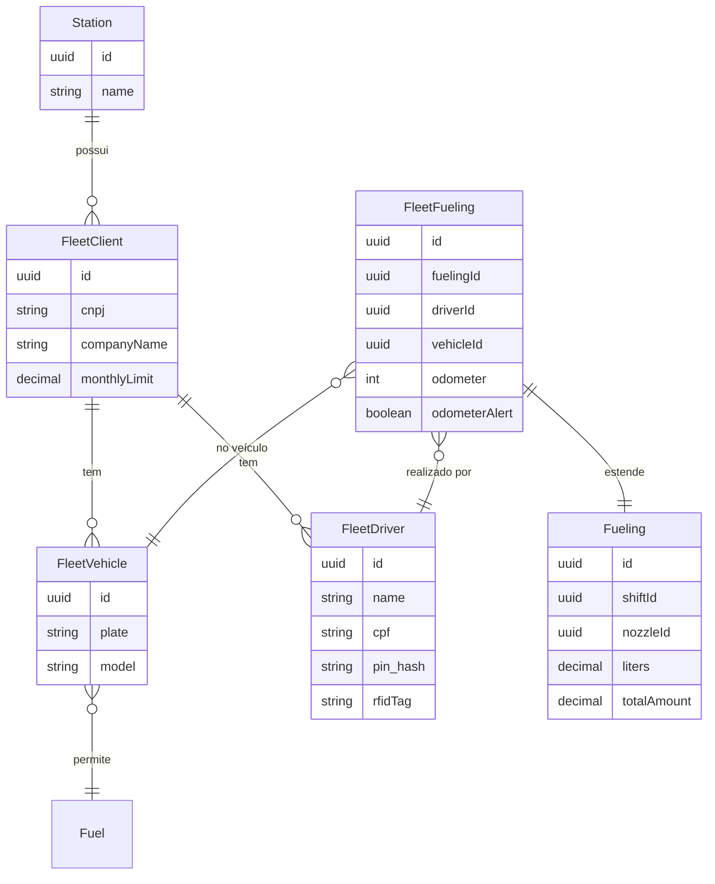

# Octane — Controle de Frota: Design Spec

**Data:** 2026-06-14
**Escopo:** Módulo `com.octane.fleet` — cadastro de clientes PJ, veículos e motoristas; restrições e identificação no abastecimento; relatório de consumo com exportação CSV. Integração com o fluxo existente `RegisterFueling`.

---

## 1. Visão Geral

### O que o módulo resolve

Postos que atendem frotas corporativas precisam de controle rigoroso sobre **quem abastece**, **o quê** e **quanto**. Sem esse controle, o posto não tem como cobrar o cliente PJ com precisão nem detectar fraudes (hodômetro regressivo, combustível indevido, consumo acima do limite contratado).

O módulo Controle de Frota responde a isso com três pilares:

1. **Cadastro** — clientes PJ com limite de crédito, veículos com combustível permitido, motoristas com PIN/RFID.
2. **Controle no abastecimento** — identificação obrigatória do motorista e do veículo, validação de regras antes de registrar.
3. **Relatório** — consumo consolidado por cliente/veículo/motorista, exportável em CSV para faturamento.

### Quem usa

| Perfil | Contexto de uso |
|---|---|
| Frentista | Identifica motorista e veículo antes de registrar o abastecimento na pista |
| Gerente do posto | Monitora consumo por cliente, consulta divergências de hodômetro |
| Cliente PJ (frota) | Recebe relatório CSV mensal para conciliar com notas fiscais e controles internos |

### Referências de mercado consultadas

- **RotaExata** — integração com sistema de rastreamento; autorização por placa + motorista
- **Abastek** — PIN por motorista, limite de volume por veículo, detecção de hodômetro regressivo
- **ConectCar** — tag RFID no veículo; autorização automática sem intervenção do frentista

---

## 2. Modelo de Domínio

### Entidades

#### FleetClient (Cliente PJ)

Representa a empresa contratante da conta-frota no posto.

| Campo | Tipo | Restrições |
|---|---|---|
| `id` | UUID | PK |
| `station` | Station | FK — cliente é vinculado ao posto |
| `cnpj` | String(18) | NOT NULL, único por posto, formato `XX.XXX.XXX/XXXX-XX` |
| `companyName` | String(150) | NOT NULL |
| `tradeName` | String(100) | Nullable — nome fantasia |
| `monthlyLimit` | BigDecimal(12,2) | Nullable — limite em R$; null = sem limite |
| `active` | boolean | NOT NULL, default `true` |
| `createdAt` | LocalDateTime | NOT NULL |

#### FleetVehicle (Veículo)

Representa cada veículo da frota vinculado a um cliente.

| Campo | Tipo | Restrições |
|---|---|---|
| `id` | UUID | PK |
| `client` | FleetClient | FK NOT NULL |
| `plate` | String(10) | NOT NULL, único global (placa nacional), padrão Mercosul ou antigo |
| `model` | String(100) | Nullable — ex: "VW Delivery 9.170" |
| `allowedFuel` | Fuel | FK NOT NULL — somente este combustível pode ser abastecido |
| `active` | boolean | NOT NULL, default `true` |
| `createdAt` | LocalDateTime | NOT NULL |

#### FleetDriver (Motorista)

Representa o motorista autorizado a abastecer pela conta-frota.

| Campo | Tipo | Restrições |
|---|---|---|
| `id` | UUID | PK |
| `client` | FleetClient | FK NOT NULL |
| `name` | String(100) | NOT NULL |
| `cpf` | String(14) | NOT NULL, único por cliente |
| `pin` | String(6) | Nullable — PIN numérico hasheado (BCrypt); mutuamente exclusivo com `rfidTag` |
| `rfidTag` | String(50) | Nullable — identificador do cartão RFID |
| `active` | boolean | NOT NULL, default `true` |
| `createdAt` | LocalDateTime | NOT NULL |

> **Decisão:** PIN e RFID coexistem no mesmo motorista. O frentista pode identificar o mesmo motorista por qualquer um dos dois. Nenhum dos dois é obrigatório simultaneamente — o cadastro exige ao menos um.

#### FleetFueling (Abastecimento de Frota)

Extensão do `Fueling` existente com dados de frota. Não substitui `Fueling` — é um registro complementar vinculado ao mesmo evento.

| Campo | Tipo | Restrições |
|---|---|---|
| `id` | UUID | PK |
| `fueling` | Fueling | FK NOT NULL, UNIQUE — relação 1:1 |
| `driver` | FleetDriver | FK NOT NULL |
| `vehicle` | FleetVehicle | FK NOT NULL |
| `odometer` | Integer | NOT NULL — km informado pelo motorista |
| `odometerAlert` | boolean | NOT NULL, default `false` — true se hodômetro < leitura anterior |
| `previousOdometer` | Integer | Nullable — valor do abastecimento anterior do veículo |
| `createdAt` | LocalDateTime | NOT NULL |

### Diagrama de relacionamentos



---

## 3. Use Cases

### 3.1 CreateFleetClient

**Entrada:** `CreateFleetClientRequest(stationId, cnpj, companyName, tradeName, monthlyLimit)`

**Saída:** `FleetClientResponse`

**Regras:**
- CNPJ deve ser válido (dígito verificador)
- CNPJ único por posto (um mesmo CNPJ pode ter contas em postos diferentes)
- `monthlyLimit` deve ser positivo se informado

---

### 3.2 UpdateFleetClient

**Entrada:** `UpdateFleetClientRequest(companyName, tradeName, monthlyLimit, active)`

**Saída:** `FleetClientResponse`

**Regras:**
- Não permite alterar CNPJ (campo imutável após criação)
- Inativar cliente não apaga veículos nem motoristas, apenas bloqueia novos abastecimentos

---

### 3.3 CreateFleetVehicle

**Entrada:** `CreateFleetVehicleRequest(clientId, plate, model, allowedFuelId)`

**Saída:** `FleetVehicleResponse`

**Regras:**
- Placa única globalmente (um veículo não pode estar em duas frotas ao mesmo tempo)
- `allowedFuelId` deve referenciar um combustível ativo
- Formato de placa: aceita padrão antigo `AAA-9999` e Mercosul `AAA9A99` (validação por regex)

---

### 3.4 UpdateFleetVehicle

**Entrada:** `UpdateFleetVehicleRequest(model, allowedFuelId, active)`

**Saída:** `FleetVehicleResponse`

**Regras:**
- Não permite alterar placa (campo imutável)
- Inativar veículo não cancela abastecimentos anteriores

---

### 3.5 CreateFleetDriver

**Entrada:** `CreateFleetDriverRequest(clientId, name, cpf, pin, rfidTag)`

**Saída:** `FleetDriverResponse` (sem expor hash do PIN)

**Regras:**
- CPF único por cliente (o mesmo CPF pode ter motorista em clientes distintos)
- CPF deve ser válido (dígito verificador)
- Ao menos um entre `pin` e `rfidTag` deve ser informado
- PIN deve ter exatamente 6 dígitos numéricos
- PIN é armazenado como hash BCrypt — nunca em texto claro

---

### 3.6 UpdateFleetDriver

**Entrada:** `UpdateFleetDriverRequest(name, pin, rfidTag, active)`

**Saída:** `FleetDriverResponse`

**Regras:**
- Permite atualizar PIN (novo valor é re-hasheado)
- Permite remover PIN ou RFID, desde que o outro permaneça

---

### 3.7 IdentifyFleetDriver

**Entrada:** `IdentifyFleetDriverRequest(stationId, identifier, identifierType)` onde `identifierType` = `CPF | PIN | RFID`

**Saída:** `FleetDriverIdentificationResponse(driver, client, vehicles)`

**Regras:**
- Busca motoristas ativos do posto pelo identificador informado
- Se `identifierType = PIN`, compara com BCrypt (não expõe hash)
- Retorna lista de veículos ativos vinculados ao cliente do motorista
- Retorna erro `404` se não encontrado; `409` se cliente ou motorista inativos

> **Propósito:** endpoint chamado pelo frontend antes de registrar o abastecimento, para pré-preencher cliente e listar veículos disponíveis.

---

### 3.8 RegisterFleetFueling

**Entrada:** `RegisterFleetFuelingRequest(shiftId, nozzleId, liters, totalAmount, paymentMethod, driverId, vehicleId, odometer, notes)`

**Saída:** `FleetFuelingResponse`

**Regras (em ordem de verificação):**

1. Delega ao `RegisterFuelingUseCase` existente para criar o `Fueling` base (turno aberto, bico ativo, preço vigente)
2. Verifica que `vehicle` está ativo e pertence ao cliente do `driver`
3. Verifica que o combustível do bico (`nozzle.fuel`) coincide com `vehicle.allowedFuel` → se não, lança `BusinessException("Combustível não permitido para este veículo")`
4. Verifica limite mensal do cliente: soma `totalAmount` dos `FleetFueling` do mês corrente para o cliente + o novo `totalAmount` → se ultrapassar `monthlyLimit`, lança `BusinessException("Limite mensal do cliente atingido")`
5. Busca último `FleetFueling` do veículo ordenado por `createdAt DESC` → se `odometer < previousOdometer`, persiste `odometerAlert = true` e `previousOdometer` (não bloqueia o abastecimento, apenas alerta)
6. Persiste `FleetFueling` vinculado ao `Fueling` recém-criado
7. Retorna `FleetFuelingResponse` com flag `odometerAlert`

> **Decisão de design:** hodômetro regressivo não bloqueia o abastecimento — bloquear causaria atrito operacional em postos movimentados. O alerta é registrado e visível no relatório, cabendo ao gerente investigar.

> **Decisão de design:** `RegisterFleetFueling` chama `RegisterFuelingUseCase` internamente como um passo de delegação, não como uma chamada de endpoint. O handler expõe apenas `/api/fleet/fuelings` — o frontend de frota nunca chama `/api/shifts/{id}/fuelings` diretamente para abastecimentos de frota.

---

### 3.9 GetFleetConsumptionReport

**Entrada:** `GetFleetConsumptionReportRequest(stationId, clientId?, vehicleId?, driverId?, from, to)`

**Saída:** `FleetConsumptionReport(summary, lines)`

**Regras:**
- Todos os filtros são opcionais exceto `stationId` e o intervalo de datas
- Agrupa por veículo dentro do cliente
- `summary` contém totais: volume (L), valor (R$), quantidade de abastecimentos, alertas de hodômetro
- `lines` é lista de `FleetConsumptionLine(date, driver, vehicle, liters, amount, odometer, odometerAlert, paymentMethod)`
- Ordenado por `fueledAt DESC`

---

### 3.10 ExportFleetConsumptionCsv

**Entrada:** mesmos parâmetros de `GetFleetConsumptionReport`

**Saída:** arquivo CSV com cabeçalho em português, `Content-Disposition: attachment; filename="frota_{clientId}_{from}_{to}.csv"`

**Colunas CSV:**
`Data/Hora, Cliente, CNPJ, Motorista, CPF, Veículo, Placa, Combustível, Litros, Valor R$, Hodômetro, Alerta Hodômetro, Forma de Pagamento, Turno`

---

## 4. API REST

Todas as rotas seguem o padrão do projeto: `handler` com `@RestController`, sem `@Autowired`, injeção por construtor.

### 4.1 Clientes PJ

```
POST   /api/fleet/clients                          → 201 FleetClientResponse
GET    /api/fleet/clients?stationId=&active=       → 200 List<FleetClientResponse>
GET    /api/fleet/clients/{id}                     → 200 FleetClientResponse
PUT    /api/fleet/clients/{id}                     → 200 FleetClientResponse
PATCH  /api/fleet/clients/{id}/status              → 200 FleetClientResponse
```

**`CreateFleetClientRequest` (Record):**
```java
record CreateFleetClientRequest(
    @NotNull UUID stationId,
    @NotBlank @Pattern(regexp = "\\d{2}\\.\\d{3}\\.\\d{3}/\\d{4}-\\d{2}") String cnpj,
    @NotBlank @Size(max = 150) String companyName,
    @Size(max = 100) String tradeName,
    @Positive BigDecimal monthlyLimit   // nullable
) {}
```

**`FleetClientResponse` (Record):**
```java
record FleetClientResponse(
    UUID id,
    UUID stationId,
    String cnpj,
    String companyName,
    String tradeName,
    BigDecimal monthlyLimit,
    BigDecimal currentMonthSpend,   // calculado: soma do mês corrente
    boolean active,
    LocalDateTime createdAt
) {}
```

---

### 4.2 Veículos

```
POST   /api/fleet/vehicles                         → 201 FleetVehicleResponse
GET    /api/fleet/clients/{clientId}/vehicles      → 200 List<FleetVehicleResponse>
GET    /api/fleet/vehicles/{id}                    → 200 FleetVehicleResponse
PUT    /api/fleet/vehicles/{id}                    → 200 FleetVehicleResponse
PATCH  /api/fleet/vehicles/{id}/status             → 200 FleetVehicleResponse
```

**`CreateFleetVehicleRequest` (Record):**
```java
record CreateFleetVehicleRequest(
    @NotNull UUID clientId,
    @NotBlank @Pattern(regexp = "[A-Z]{3}[0-9]{4}|[A-Z]{3}[0-9][A-Z][0-9]{2}") String plate,
    @Size(max = 100) String model,
    @NotNull UUID allowedFuelId
) {}
```

---

### 4.3 Motoristas

```
POST   /api/fleet/drivers                          → 201 FleetDriverResponse
GET    /api/fleet/clients/{clientId}/drivers       → 200 List<FleetDriverResponse>
GET    /api/fleet/drivers/{id}                     → 200 FleetDriverResponse
PUT    /api/fleet/drivers/{id}                     → 200 FleetDriverResponse
PATCH  /api/fleet/drivers/{id}/status             → 200 FleetDriverResponse
```

**`CreateFleetDriverRequest` (Record):**
```java
record CreateFleetDriverRequest(
    @NotNull UUID clientId,
    @NotBlank @Size(max = 100) String name,
    @NotBlank @Pattern(regexp = "\\d{3}\\.\\d{3}\\.\\d{3}-\\d{2}") String cpf,
    @Pattern(regexp = "\\d{6}") String pin,     // nullable, mas ao menos pin ou rfidTag
    @Size(max = 50) String rfidTag              // nullable
) {}
```

**`FleetDriverResponse` (Record):** nunca inclui `pinHash`; inclui `hasPIN` (boolean) e `hasRFID` (boolean).

---

### 4.4 Identificação de Motorista

```
POST   /api/fleet/drivers/identify                 → 200 FleetDriverIdentificationResponse
                                                   → 404 se não encontrado
```

**`IdentifyFleetDriverRequest` (Record):**
```java
record IdentifyFleetDriverRequest(
    @NotNull UUID stationId,
    @NotBlank String identifier,
    @NotNull IdentifierType identifierType   // enum: CPF, PIN, RFID
) {}
```

**`FleetDriverIdentificationResponse` (Record):**
```java
record FleetDriverIdentificationResponse(
    FleetDriverResponse driver,
    FleetClientResponse client,
    List<FleetVehicleResponse> vehicles
) {}
```

---

### 4.5 Abastecimento de Frota

```
POST   /api/fleet/fuelings                         → 201 FleetFuelingResponse
GET    /api/fleet/fuelings/{id}                    → 200 FleetFuelingResponse
GET    /api/fleet/clients/{clientId}/fuelings      → 200 PageResponse<FleetFuelingResponse>
       ?from=&to=&vehicleId=&driverId=&page=&size=
```

**`RegisterFleetFuelingRequest` (Record):**
```java
record RegisterFleetFuelingRequest(
    @NotNull UUID shiftId,
    @NotNull UUID nozzleId,
    BigDecimal liters,                              // nullable se totalAmount informado
    BigDecimal totalAmount,                         // nullable se liters informado
    @NotBlank String paymentMethod,
    @NotNull UUID driverId,
    @NotNull UUID vehicleId,
    @NotNull @Positive Integer odometer,
    @Size(max = 300) String notes
) {}
```

**`FleetFuelingResponse` (Record):**
```java
record FleetFuelingResponse(
    UUID id,
    UUID fuelingId,
    FleetDriverResponse driver,
    FleetVehicleResponse vehicle,
    BigDecimal liters,
    BigDecimal unitPrice,
    BigDecimal totalAmount,
    String paymentMethod,
    Integer odometer,
    Integer previousOdometer,
    boolean odometerAlert,
    LocalDateTime fueledAt
) {}
```

---

### 4.6 Relatório e Exportação

```
GET    /api/fleet/reports/consumption              → 200 FleetConsumptionReport
       ?stationId=&clientId=&vehicleId=&driverId=&from=&to=

GET    /api/fleet/reports/consumption/csv          → 200 application/octet-stream
       (mesmos query params)
```

---

## 5. Migrações de Banco

As migrations seguem a sequência Flyway existente (V10 é a última). Serão criadas V11–V14.

### V11__create_fleet_clients.sql

```sql
CREATE TABLE fleet_clients (
    id            UUID PRIMARY KEY DEFAULT gen_random_uuid(),
    station_id    UUID NOT NULL REFERENCES stations(id),
    cnpj          VARCHAR(18) NOT NULL,
    company_name  VARCHAR(150) NOT NULL,
    trade_name    VARCHAR(100),
    monthly_limit NUMERIC(12,2),
    active        BOOLEAN NOT NULL DEFAULT TRUE,
    created_at    TIMESTAMP NOT NULL DEFAULT NOW(),
    CONSTRAINT uq_fleet_client_cnpj_station UNIQUE (cnpj, station_id)
);

CREATE INDEX idx_fleet_clients_station ON fleet_clients(station_id);
CREATE INDEX idx_fleet_clients_cnpj ON fleet_clients(cnpj);
```

### V12__create_fleet_vehicles.sql

```sql
CREATE TABLE fleet_vehicles (
    id              UUID PRIMARY KEY DEFAULT gen_random_uuid(),
    client_id       UUID NOT NULL REFERENCES fleet_clients(id),
    plate           VARCHAR(10) NOT NULL,
    model           VARCHAR(100),
    allowed_fuel_id UUID NOT NULL REFERENCES fuels(id),
    active          BOOLEAN NOT NULL DEFAULT TRUE,
    created_at      TIMESTAMP NOT NULL DEFAULT NOW(),
    CONSTRAINT uq_fleet_vehicle_plate UNIQUE (plate)
);

CREATE INDEX idx_fleet_vehicles_client ON fleet_vehicles(client_id);
CREATE INDEX idx_fleet_vehicles_plate ON fleet_vehicles(plate);
```

### V13__create_fleet_drivers.sql

```sql
CREATE TABLE fleet_drivers (
    id         UUID PRIMARY KEY DEFAULT gen_random_uuid(),
    client_id  UUID NOT NULL REFERENCES fleet_clients(id),
    name       VARCHAR(100) NOT NULL,
    cpf        VARCHAR(14) NOT NULL,
    pin_hash   VARCHAR(60),              -- BCrypt 60 chars
    rfid_tag   VARCHAR(50),
    active     BOOLEAN NOT NULL DEFAULT TRUE,
    created_at TIMESTAMP NOT NULL DEFAULT NOW(),
    CONSTRAINT uq_fleet_driver_cpf_client UNIQUE (cpf, client_id),
    CONSTRAINT chk_fleet_driver_auth CHECK (pin_hash IS NOT NULL OR rfid_tag IS NOT NULL)
);

CREATE INDEX idx_fleet_drivers_client ON fleet_drivers(client_id);
CREATE INDEX idx_fleet_drivers_rfid ON fleet_drivers(rfid_tag) WHERE rfid_tag IS NOT NULL;
```

### V14__create_fleet_fuelings.sql

```sql
CREATE TABLE fleet_fuelings (
    id                  UUID PRIMARY KEY DEFAULT gen_random_uuid(),
    fueling_id          UUID NOT NULL REFERENCES fuelings(id),
    driver_id           UUID NOT NULL REFERENCES fleet_drivers(id),
    vehicle_id          UUID NOT NULL REFERENCES fleet_vehicles(id),
    odometer            INTEGER NOT NULL,
    previous_odometer   INTEGER,
    odometer_alert      BOOLEAN NOT NULL DEFAULT FALSE,
    created_at          TIMESTAMP NOT NULL DEFAULT NOW(),
    CONSTRAINT uq_fleet_fueling_fueling UNIQUE (fueling_id)
);

CREATE INDEX idx_fleet_fuelings_driver    ON fleet_fuelings(driver_id);
CREATE INDEX idx_fleet_fuelings_vehicle   ON fleet_fuelings(vehicle_id);
CREATE INDEX idx_fleet_fuelings_created   ON fleet_fuelings(created_at);
```

> **Nota:** a coluna `status` da migration `V9__add_status_to_fuelings.sql` já está na tabela `fuelings`. Nenhuma alteração em tabelas existentes é necessária — o módulo de frota trabalha apenas com tabelas novas.

---

## 6. Frontend

### 6.1 Novas rotas

```
/frota                           → redirect → /frota/clientes
/frota/clientes                  → FrotaClientesPage
/frota/clientes/:clientId        → FrotaClienteDetailPage
/frota/veiculos                  → FrotaVeiculosPage    (filtrado pelo cliente selecionado)
/frota/motoristas                → FrotaMotoristaPage   (filtrado pelo cliente selecionado)
/frota/relatorio                 → FrotaRelatorioPage
```

A sidebar ganha um novo item "Frota" com 4 sub-itens: Clientes / Veículos / Motoristas / Relatório.

---

### 6.2 Estrutura de arquivos novos

```
frontend/src/
├── api/
│   ├── fleet-clients.ts        # CRUD FleetClient + currentMonthSpend
│   ├── fleet-vehicles.ts       # CRUD FleetVehicle
│   ├── fleet-drivers.ts        # CRUD FleetDriver + identify
│   ├── fleet-fuelings.ts       # registerFleetFueling, listByClient
│   └── fleet-reports.ts        # getConsumptionReport, downloadCsv
├── components/
│   └── frota/
│       ├── FrotaSubnav.tsx          # Sub-sidebar: Clientes / Veículos / Motoristas / Relatório
│       ├── FleetClientSheet.tsx     # Sheet criar/editar cliente PJ
│       ├── FleetVehicleSheet.tsx    # Sheet criar/editar veículo
│       ├── FleetDriverSheet.tsx     # Sheet criar/editar motorista
│       ├── FleetFuelingForm.tsx     # Form de abastecimento frota (na pista)
│       ├── DriverIdentifier.tsx     # Widget de identificação: CPF/PIN/RFID → resultado
│       ├── OdometerAlert.tsx        # Badge de alerta de hodômetro regressivo
│       └── FleetReportTable.tsx     # Tabela de consumo com exportação CSV
└── pages/
    ├── FrotaClientesPage.tsx
    ├── FrotaClienteDetailPage.tsx
    ├── FrotaVeiculosPage.tsx
    ├── FrotaMotoristaPage.tsx
    └── FrotaRelatorioPage.tsx
```

---

### 6.3 Modificação no fluxo de abastecimento (Pista)

O `FuelingForm` existente ganha um toggle "Abastecimento de Frota". Quando ativado:

1. O form exibe o `DriverIdentifier` — campo de entrada + select de tipo (CPF / PIN / RFID) + botão "Identificar"
2. Ao identificar com sucesso, exibe: nome do motorista, empresa, e um select de veículo (pré-preenchido com os veículos ativos do cliente)
3. O campo de placa manual some — é preenchido automaticamente ao selecionar o veículo
4. Aparece o campo "Hodômetro (km)" obrigatório
5. O select de forma de pagamento adiciona "Frota" como opção destacada (já existe em `PaymentMethod`)
6. O submit chama `POST /api/fleet/fuelings` em vez de `POST /api/shifts/{id}/fuelings`
7. Se a resposta retornar `odometerAlert: true`, exibe um toast de aviso amarelo: "Hodômetro informado ({X} km) é menor que o registrado anteriormente ({Y} km). Verifique possível irregularidade."

---

### 6.4 Telas de Cadastro (padrão lista + sheet lateral)

Todas seguem o padrão estabelecido no spec do frontend operacional: tabela + botão "+" + sheet de criação/edição.

**FrotaClientesPage:**
- Colunas: Razão Social / CNPJ / Limite Mensal / Consumo do Mês / Status
- Barra de progresso inline na coluna "Consumo do Mês" (% do limite)
- Clicar na linha navega para `FrotaClienteDetailPage`

**FrotaClienteDetailPage:**
- Cabeçalho com dados do cliente + badge de status
- Abas: Veículos | Motoristas | Histórico de Abastecimentos
- Cada aba tem sua própria lista com ações de edição

**FrotaVeiculosPage:**
- Seletor de cliente no topo (dropdown)
- Colunas: Placa / Modelo / Combustível Permitido / Status

**FrotaMotoristaPage:**
- Seletor de cliente no topo
- Colunas: Nome / CPF / Autenticação (chips: PIN / RFID) / Status

---

### 6.5 FrotaRelatorioPage

- Filtros: cliente (obrigatório), veículo (opcional), motorista (opcional), intervalo de datas (obrigatório)
- Bloco de resumo no topo: volume total / valor total / qtd. abastecimentos / alertas de hodômetro
- Tabela paginada (`FleetReportTable`)
- Botão "Exportar CSV" chama `GET /api/fleet/reports/consumption/csv` com os mesmos filtros e inicia o download via `<a>` com `download` attribute

---

## 7. Regras de Negócio Críticas

### 7.1 Validação de combustível permitido

```
nozzle.fuel.id ≠ vehicle.allowedFuel.id → BusinessException("Combustível não permitido para este veículo")
```

Esta verificação ocorre no `RegisterFleetFuelingUseCase` **antes** de delegar ao `RegisterFuelingUseCase`. Se o combustível não é permitido, o `Fueling` base não chega a ser criado.

### 7.2 Limite mensal de crédito

```sql
SELECT COALESCE(SUM(f.total_amount), 0)
FROM fleet_fuelings ff
JOIN fuelings f ON f.id = ff.fueling_id
WHERE ff.vehicle_id IN (
    SELECT id FROM fleet_vehicles WHERE client_id = :clientId
)
AND DATE_TRUNC('month', f.fueled_at) = DATE_TRUNC('month', NOW())
AND f.status = 'ACTIVE'
```

Se `currentMonthSpend + novoTotalAmount > client.monthlyLimit` → `BusinessException("Limite mensal do cliente atingido. Consumido: R$ X,XX / Limite: R$ Y,YY")`.

Observações:
- Abastecimentos cancelados (`status = CANCELLED`) **não** contam para o limite
- Limite `null` significa sem restrição de crédito

### 7.3 Detecção de hodômetro regressivo

```
previousOdometer = MAX(odometer) WHERE vehicle_id = :vehicleId AND status = 'ACTIVE'

if (odometer < previousOdometer) → odometerAlert = true
```

O abastecimento **prossegue normalmente**. O frentista recebe aviso. O alerta fica registrado em `fleet_fuelings.odometer_alert = true` e aparece destacado no relatório (linha em amarelo + ícone de alerta).

### 7.4 Autenticação de motorista com PIN

- PIN nunca trafega em texto claro após o cadastro — apenas no momento do `identify` (enviado pelo cliente via HTTPS)
- Comparação: `BCrypt.checkpw(pinInformado, driver.pinHash)`
- O endpoint `identify` não revela se o CPF existe mas o PIN está errado vs. CPF inexistente — retorna sempre `404` (prevenção de enumeração)

### 7.5 Exclusividade de placa

- Uma placa só pode estar em uma frota ativa por vez
- Se o usuário tentar cadastrar uma placa já existente em outro cliente, recebe `409 Conflict` com mensagem explicativa

### 7.6 Integridade na inativação

- Inativar `FleetClient` → não cria novos abastecimentos, mas histórico é mantido
- Inativar `FleetVehicle` → mesmo comportamento
- Inativar `FleetDriver` → mesmo comportamento
- Não existe exclusão física de nenhuma entidade de frota (soft delete via `active = false`)

---

## 8. Estratégia de Testes

### 8.1 Testes unitários (por use case)

Seguir o padrão dos 120 testes existentes — sem Spring context, injeção manual dos mocks.

| Use Case | O que testar |
|---|---|
| `CreateFleetClient` | CNPJ inválido, CNPJ duplicado por posto, limit negativo |
| `CreateFleetVehicle` | placa duplicada, combustível inativo, formato de placa inválido |
| `CreateFleetDriver` | CPF inválido, PIN sem 6 dígitos, nenhum método de auth |
| `IdentifyFleetDriver` | CPF não encontrado, PIN errado, cliente inativo, motorista inativo |
| `RegisterFleetFueling` | combustível errado, limite atingido, hodômetro ok, hodômetro regressivo (verifica flag), turno fechado |
| `GetFleetConsumptionReport` | sem abastecimentos, com alertas, filtros combinados |

### 8.2 Testes de integração (com banco)

- Verificar constraint `UNIQUE (plate)` em `fleet_vehicles`
- Verificar constraint `CHECK (pin_hash IS NOT NULL OR rfid_tag IS NOT NULL)` em `fleet_drivers`
- Verificar constraint `UNIQUE (fueling_id)` em `fleet_fuelings`
- Calcular `currentMonthSpend` corretamente ignorando abastecimentos cancelados

### 8.3 Testes de handler (MockMvc)

- `POST /api/fleet/clients` com CNPJ inválido → 400
- `POST /api/fleet/drivers/identify` com PIN errado → 404
- `POST /api/fleet/fuelings` com combustível indevido → 422
- `GET /api/fleet/reports/consumption/csv` → Content-Type `application/octet-stream`, cabeçalhos corretos

### 8.4 Testes de frontend (manual / Playwright futuro)

- Fluxo completo: identificar motorista → selecionar veículo → informar hodômetro → confirmar → verificar toast de alerta de hodômetro
- Tentativa de abastecimento com combustível diferente do permitido → mensagem de erro clara
- Exportação CSV: verificar que o arquivo é baixado e contém as colunas esperadas

---

## 9. Decisões de Design

### 9.1 Extensão, não substituição de `Fueling`

**Decisão:** `FleetFueling` é uma tabela separada ligada por FK 1:1 ao `Fueling` existente.

**Alternativa considerada:** adicionar colunas de frota direto em `fuelings` (nullable).

**Motivo da escolha:** manter `fuelings` limpo e ortogonal ao módulo de frota. O relatório LMC/ANP continua funcionando sem alterações. Consultas de frota ficam no schema próprio. Trade-off: um JOIN a mais nas queries de relatório de frota.

---

### 9.2 Hodômetro não bloqueia, apenas alerta

**Decisão:** hodômetro regressivo gera flag `odometerAlert = true` mas não impede o abastecimento.

**Alternativa considerada:** bloquear o abastecimento e exigir confirmação do gerente.

**Motivo da escolha:** em ambiente operacional de pista, bloqueios aumentam atrito e tempo de fila. A responsabilidade de investigar é do gerente, não do sistema em tempo real. Alerta registrado é suficiente para auditoria posterior (padrão adotado pela Abastek).

---

### 9.3 PIN com BCrypt, RFID em texto claro

**Decisão:** PIN é hasheado com BCrypt; RFID é armazenado sem hash.

**Motivo:** PIN é um segredo do usuário. RFID é apenas um identificador de hardware — o cartão físico já é a barreira de segurança. Hashear RFID não traria ganho prático e dificultaria troubleshooting.

---

### 9.4 Identificação via endpoint dedicado antes do abastecimento

**Decisão:** endpoint `POST /api/fleet/drivers/identify` separado do `POST /api/fleet/fuelings`.

**Alternativa considerada:** enviar identificador junto com o request de abastecimento e resolver tudo no mesmo use case.

**Motivo da escolha:** UX do frentista — ele identifica o motorista, pré-visualiza os dados (empresa, veículos disponíveis) e só então registra. Uma chamada única tornaria o form mais complexo e impediria o pré-preenchimento progressivo do formulário.

---

### 9.5 Escopo de cliente por posto

**Decisão:** `FleetClient` é vinculado a um `Station`. O mesmo CNPJ pode ter contas em postos diferentes.

**Alternativa considerada:** `FleetClient` global (independente de posto).

**Motivo da escolha:** cada posto pode ter condições comerciais diferentes com o mesmo cliente. Mantém isolamento operacional entre postos de uma rede.

---

### 9.6 Sem módulo financeiro (crédito a prazo) neste escopo

**Decisão:** o controle de frota nesta versão controla apenas o limite de **valor acumulado no mês**. Não há contas a receber, faturas, boletos nem integração com financeiro.

**Motivo:** escopo mínimo viável. O limite mensal é suficiente para os casos de uso mais comuns. Módulo financeiro (faturamento de frota) pode ser adicionado depois como `com.octane.fleet.billing`.

---

## Apêndice: Estrutura de pacotes backend

```
com.octane.fleet/
├── domain/
│   ├── FleetClient.java
│   ├── FleetVehicle.java
│   ├── FleetDriver.java
│   ├── FleetFueling.java
│   ├── IdentifierType.java          (enum: CPF, PIN, RFID)
│   └── repository/
│       ├── FleetClientRepository.java
│       ├── FleetVehicleRepository.java
│       ├── FleetDriverRepository.java
│       └── FleetFuelingRepository.java
├── usecase/
│   ├── client/
│   │   ├── CreateFleetClientUseCase.java
│   │   ├── CreateFleetClientRequest.java
│   │   ├── UpdateFleetClientUseCase.java
│   │   ├── ListFleetClientsUseCase.java
│   │   └── FleetClientResponse.java
│   ├── vehicle/
│   │   ├── CreateFleetVehicleUseCase.java
│   │   ├── CreateFleetVehicleRequest.java
│   │   ├── UpdateFleetVehicleUseCase.java
│   │   └── FleetVehicleResponse.java
│   ├── driver/
│   │   ├── CreateFleetDriverUseCase.java
│   │   ├── CreateFleetDriverRequest.java
│   │   ├── UpdateFleetDriverUseCase.java
│   │   ├── IdentifyFleetDriverUseCase.java
│   │   ├── IdentifyFleetDriverRequest.java
│   │   ├── FleetDriverIdentificationResponse.java
│   │   └── FleetDriverResponse.java
│   ├── fueling/
│   │   ├── RegisterFleetFuelingUseCase.java
│   │   ├── RegisterFleetFuelingRequest.java
│   │   └── FleetFuelingResponse.java
│   └── report/
│       ├── GetFleetConsumptionReportUseCase.java
│       ├── ExportFleetConsumptionCsvUseCase.java
│       ├── FleetConsumptionReport.java
│       └── FleetConsumptionLine.java
└── handler/
    ├── FleetClientHandler.java
    ├── FleetVehicleHandler.java
    ├── FleetDriverHandler.java
    ├── FleetFuelingHandler.java
    └── FleetReportHandler.java
```
