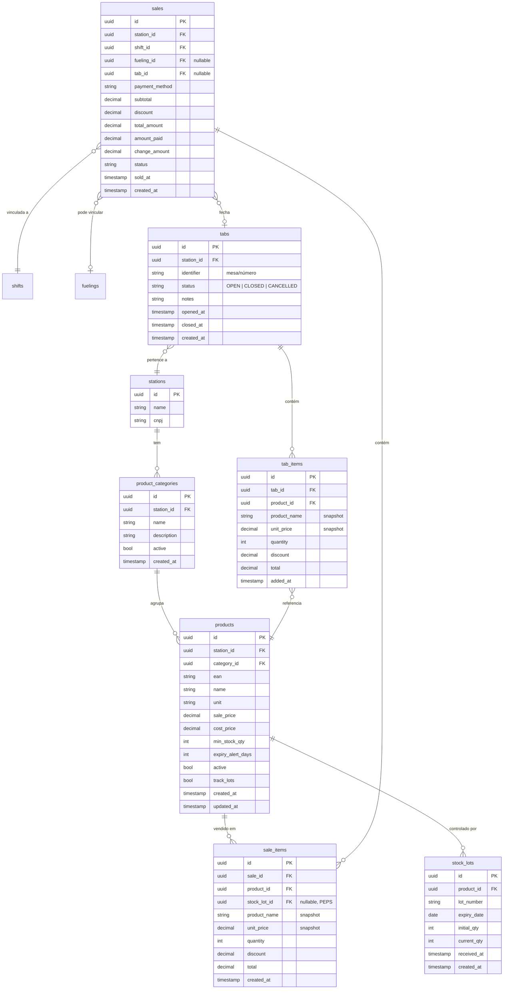

# Octane — Loja de Conveniência (PDV): Design Spec

**Data:** 2026-06-14
**Escopo:** Módulo completo de PDV para loja de conveniência integrada ao posto de combustível. Inclui cadastro de produtos, controle de estoque/lote/validade, frente de caixa, comanda eletrônica (padaria/cafeteria) e relatório de Curva ABC.

---

## 1. Visão Geral

### O que o módulo resolve

A loja de conveniência é a segunda maior fonte de receita de um posto de combustível depois do combustível em si. Hoje os operadores usam caixas genéricos (ou papel) sem integração com a pista — o cliente que abastece e compra água precisa pagar em dois caixas separados. O módulo resolve:

- **Fragmentação do caixa:** pagamento unificado combustível + loja em uma operação
- **Perda de estoque invisível:** sem rastreabilidade de entrada/saída, ruptura e vencimento passam despercebidos
- **Obrigação legal ignorada:** RDC 655/2022 ANVISA exige rastreabilidade por lote/validade durante 6 meses após vencimento — quase nenhum pequeno posto cumpre
- **Gestão de mix às cegas:** sem Curva ABC o operador não sabe o que girar nem o que cortar

### Quem usa

| Perfil | Contexto de uso | Tela principal |
|---|---|---|
| Frentista / Atendente | Balcão de caixa, tablet ou PC dedicado | PDV (frente de caixa) |
| Atendente de padaria | Mesa ou tablet na área da padaria | Comanda eletrônica |
| Gerente de loja | Back-office, PC | Cadastros + Curva ABC |
| Dono / Gerente geral | Back-office, mobile | Relatórios + alertas |

---

## 2. Modelo de Domínio

### Diagrama de entidades



### Entidades em detalhe

#### `ProductCategory`
Categoria de produto (ex: Bebidas, Salgados, Tabacaria, Higiene). Pertence a um posto — permite customização do mix por unidade. Deleção lógica: `active = false`.

#### `Product`
Produto do catálogo da loja. Campos relevantes:
- `ean`: código de barras EAN-8 ou EAN-13 (pode ser null para produtos sem código universal — como salgados de padaria)
- `unit`: enum `UN` (unidade), `KG` (quilograma), `L` (litro)
- `track_lots`: se `true`, o sistema exige número de lote e validade em cada entrada de estoque e aplica PEPS na saída
- `min_stock_qty`: abaixo deste valor, produto aparece em alertas de ruptura
- `expiry_alert_days`: dias antes do vencimento para disparar alerta (default 7, configurável por produto)

#### `StockLot`
Registro de entrada de estoque com número de lote e validade. Cada venda desconta do lote mais antigo primeiro (PEPS). `current_qty` é atualizado a cada venda. Quando `current_qty = 0` o lote é esgotado (mas mantido no histórico para rastreabilidade ANVISA por 6 meses após `expiry_date`).

#### `Sale`
Representa uma transação de venda. Pode estar vinculada a:
- `shift_id`: sempre — uma venda ocorre dentro de um turno
- `fueling_id`: opcional — quando o cliente abasteceu e depois comprou na loja no mesmo atendimento
- `tab_id`: opcional — quando o pagamento fecha uma comanda aberta

Status: `OPEN` (carrinho em andamento), `COMPLETED`, `CANCELLED`.

#### `SaleItem`
Item de uma venda. Snapshot do nome e preço do produto no momento da venda (o preço pode mudar depois, o histórico precisa ser fiel). `stock_lot_id` é preenchido automaticamente pelo use case de venda via PEPS.

#### `Tab` (Comanda)
Comanda eletrônica para consumo na padaria/cafeteria. Identificada por `identifier` (ex: "Mesa 3", "Balcão 1", número sequencial). Status: `OPEN`, `CLOSED`, `CANCELLED`. Quando fechada, é vinculada à `Sale` que a pagou.

#### `TabItem`
Item adicionado à comanda. Snapshot de nome e preço. Independente de `StockLot` — o baixo de estoque acontece somente no momento em que a comanda é paga e convertida em `Sale`.

---

## 3. Use Cases

### 3.1 Cadastro de Produtos

#### `CreateProductUseCase`
- **Entrada:** `CreateProductRequest(stationId, categoryId, ean, name, unit, salePrice, costPrice, minStockQty, expiryAlertDays, trackLots)`
- **Saída:** `Product`
- **Regras:**
  - EAN único por posto (se informado)
  - `salePrice >= costPrice` é recomendação (warning), não bloqueio
  - `minStockQty >= 0`
  - `expiryAlertDays` entre 1 e 365

#### `UpdateProductUseCase`
- **Entrada:** `UpdateProductRequest(name, categoryId, salePrice, costPrice, minStockQty, expiryAlertDays)`
- **Regras:** não permite alterar `ean` se já houve vendas associadas

#### `DeactivateProductUseCase`
- **Regras:** não desativa produto com lotes abertos com quantidade > 0; exige zerar estoque primeiro

#### `ReceiveStockUseCase`
- **Entrada:** `ReceiveStockRequest(productId, lotNumber, expiryDate, quantity, receivedAt)`
- **Saída:** `StockLot` criado
- **Regras:**
  - Obrigatório se `product.trackLots = true`
  - Para produtos sem `trackLots`, cria lote interno sem número nem validade (simplificado)
  - `quantity > 0`
  - `expiryDate` obrigatória se `trackLots = true`
  - Não aceita lote com validade já expirada
  - `lotNumber` único por `productId`

#### `ListLowStockProductsUseCase`
- **Entrada:** `stationId`
- **Saída:** lista de produtos onde soma de `stock_lots.current_qty` ≤ `product.min_stock_qty`

#### `ListExpiringProductsUseCase`
- **Entrada:** `stationId, withinDays (default 7)`
- **Saída:** lotes onde `expiry_date <= NOW() + withinDays` e `current_qty > 0`

---

### 3.2 Frente de Caixa (PDV)

#### `LookupProductUseCase`
- **Entrada:** `stationId, query (ean ou nome)`
- **Saída:** produto com estoque disponível total
- **Regras:**
  - Busca por EAN é exata
  - Busca por nome é `ILIKE %query%`, limitado a 20 resultados
  - Exclui produtos com estoque total = 0

#### `OpenSaleUseCase`
- **Entrada:** `OpenSaleRequest(stationId, shiftId, fuelingId?)`
- **Saída:** `Sale` em status `OPEN`
- **Regras:** só cria uma nova venda se não houver outra `OPEN` para o mesmo operador (ou permite múltiplas — decisão de design: ver seção 9)

#### `AddItemToSaleUseCase`
- **Entrada:** `AddItemRequest(saleId, productId, quantity, discount?)`
- **Saída:** `SaleItem` adicionado
- **Regras:**
  - Verifica estoque disponível (soma de `current_qty` dos lotes)
  - Bloqueia se estoque insuficiente
  - Bloqueia se produto tem lote vencido e nenhum lote válido com estoque
  - Não confirma baixo de estoque aqui — apenas reserva na memória da venda

#### `RemoveItemFromSaleUseCase` / `UpdateItemQuantityUseCase`
- Ajusta itens do carrinho enquanto venda em status `OPEN`

#### `CompleteSaleUseCase`
- **Entrada:** `CompleteSaleRequest(saleId, paymentMethod, amountPaid, tabId?)`
- **Saída:** `Sale` em status `COMPLETED`
- **Regras:**
  - Calcula troco: `change = amountPaid - total_amount` (somente para `CASH`)
  - Para outros métodos: `amountPaid == total_amount` (validação)
  - Executa baixo de estoque PEPS para cada `SaleItem`: itera lotes por `received_at ASC`, desconta até zerar o `quantity` do item
  - Se `tabId` informado: marca a `Tab` como `CLOSED` e vincula à venda
  - Dispara verificação de ruptura assíncrona após concluir
  - Transação única — rollback completo se qualquer baixo falhar

#### `CancelSaleUseCase`
- **Entrada:** `saleId, reason`
- **Regras:** só cancela vendas `OPEN`; vendas `COMPLETED` exigem estorno explícito (fora do escopo da Fase 1)

---

### 3.3 Comanda Eletrônica

#### `OpenTabUseCase`
- **Entrada:** `OpenTabRequest(stationId, identifier)`
- **Saída:** `Tab` em status `OPEN`
- **Regras:**
  - `identifier` único entre comandas `OPEN` do mesmo posto
  - Máximo de comandas abertas simultâneas: 50 (configurável, evita abuse)

#### `AddItemToTabUseCase`
- **Entrada:** `AddItemToTabRequest(tabId, productId, quantity, discount?)`
- **Saída:** `TabItem`
- **Regras:**
  - Não baixa estoque agora — apenas registra consumo
  - Verifica disponibilidade de estoque para fins de alerta (não bloqueio na comanda)

#### `RemoveItemFromTabUseCase` / `UpdateTabItemUseCase`
- Ajusta itens enquanto comanda `OPEN`

#### `CloseTabWithSaleUseCase`
- **Entrada:** `CloseTabWithSaleRequest(tabId, shiftId, fuelingId?, paymentMethod, amountPaid)`
- **Saída:** `Sale` completa + `Tab` fechada
- **Regras:**
  - Copia todos os `TabItem`s para `SaleItem`s
  - Executa `CompleteSaleUseCase` internamente
  - Se `fuelingId` informado, o total da sale não inclui o combustível (apenas a comanda) — o `fuelingId` é só para rastreabilidade do atendimento
  - Atomicidade: tab fecha e sale completa na mesma transação

---

### 3.4 Curva ABC

#### `GenerateAbcCurveUseCase`
- **Entrada:** `AbcCurveRequest(stationId, from, to, categoryId?)`
- **Saída:** `List<AbcProductResult>` com classificação
- **Regras:**
  - Agrega `SaleItem.total` por `productId` no período
  - Ordena por faturamento decrescente
  - Classifica: A = top 80% do faturamento acumulado, B = próximos 15%, C = últimos 5%
  - Inclui produtos com zero venda no período como "classe C" (ou omite — ver seção 9)
  - Processamento síncrono para períodos ≤ 90 dias; assíncrono (job) para períodos maiores

---

## 4. API REST

Prefixo base: `/api`

### Categorias

| Método | Rota | Descrição |
|---|---|---|
| `GET` | `/api/stations/{stationId}/product-categories` | Lista categorias do posto |
| `POST` | `/api/stations/{stationId}/product-categories` | Cria categoria |
| `PUT` | `/api/product-categories/{id}` | Atualiza categoria |
| `PATCH` | `/api/product-categories/{id}/status` | Ativa/desativa |

### Produtos

| Método | Rota | Descrição |
|---|---|---|
| `GET` | `/api/stations/{stationId}/products` | Lista produtos (filtros: `categoryId`, `active`, `search`) |
| `POST` | `/api/stations/{stationId}/products` | Cria produto |
| `PUT` | `/api/products/{id}` | Atualiza produto |
| `PATCH` | `/api/products/{id}/status` | Ativa/desativa |
| `GET` | `/api/products/{id}/stock` | Estoque atual (lotes + totais) |
| `POST` | `/api/products/{id}/stock/receive` | Entrada de lote |
| `GET` | `/api/stations/{stationId}/products/lookup?q={ean_ou_nome}` | Busca para PDV |
| `GET` | `/api/stations/{stationId}/alerts/low-stock` | Produtos em ruptura |
| `GET` | `/api/stations/{stationId}/alerts/expiring?days=7` | Lotes a vencer |

### Vendas (PDV)

| Método | Rota | Descrição |
|---|---|---|
| `POST` | `/api/stations/{stationId}/sales` | Abre nova venda |
| `GET` | `/api/sales/{id}` | Detalhe da venda |
| `POST` | `/api/sales/{id}/items` | Adiciona item |
| `DELETE` | `/api/sales/{saleId}/items/{itemId}` | Remove item |
| `PATCH` | `/api/sales/{saleId}/items/{itemId}` | Atualiza quantidade/desconto |
| `POST` | `/api/sales/{id}/complete` | Fecha venda (paga) |
| `POST` | `/api/sales/{id}/cancel` | Cancela venda aberta |
| `GET` | `/api/stations/{stationId}/sales?from=&to=&shiftId=` | Histórico de vendas |

### Comandas

| Método | Rota | Descrição |
|---|---|---|
| `POST` | `/api/stations/{stationId}/tabs` | Abre comanda |
| `GET` | `/api/stations/{stationId}/tabs?status=OPEN` | Lista comandas abertas |
| `GET` | `/api/tabs/{id}` | Detalhe da comanda |
| `POST` | `/api/tabs/{id}/items` | Adiciona item |
| `DELETE` | `/api/tabs/{tabId}/items/{itemId}` | Remove item |
| `PATCH` | `/api/tabs/{tabId}/items/{itemId}` | Atualiza item |
| `POST` | `/api/tabs/{id}/close` | Fecha comanda gerando venda |
| `POST` | `/api/tabs/{id}/cancel` | Cancela comanda (sem baixo de estoque) |

### Curva ABC

| Método | Rota | Descrição |
|---|---|---|
| `GET` | `/api/stations/{stationId}/reports/abc?from=&to=&categoryId=` | Gera/retorna Curva ABC |

---

### Payloads principais (Java Records)

```java
// Criar produto
record CreateProductRequest(
    @NotNull UUID categoryId,
    String ean,                         // nullable
    @NotBlank @Size(max = 200) String name,
    @NotNull String unit,               // UN | KG | L
    @NotNull @DecimalMin("0.01") BigDecimal salePrice,
    @NotNull @DecimalMin("0.00") BigDecimal costPrice,
    @Min(0) int minStockQty,
    @Min(1) @Max(365) int expiryAlertDays,
    boolean trackLots
) {}

// Resposta de produto
record ProductResponse(
    UUID id,
    UUID categoryId,
    String categoryName,
    String ean,
    String name,
    String unit,
    BigDecimal salePrice,
    BigDecimal costPrice,
    int minStockQty,
    int expiryAlertDays,
    boolean trackLots,
    boolean active,
    int totalStock,             // soma dos lotes
    LocalDateTime createdAt,
    LocalDateTime updatedAt
) {}

// Entrada de estoque
record ReceiveStockRequest(
    String lotNumber,           // nullable se !trackLots
    LocalDate expiryDate,       // nullable se !trackLots
    @Min(1) int quantity,
    LocalDateTime receivedAt
) {}

// Abrir venda
record OpenSaleRequest(
    @NotNull UUID shiftId,
    UUID fuelingId              // nullable
) {}

// Adicionar item à venda
record AddSaleItemRequest(
    @NotNull UUID productId,
    @Min(1) int quantity,
    @DecimalMin("0.00") BigDecimal discount  // nullable → 0
) {}

// Completar venda
record CompleteSaleRequest(
    @NotNull String paymentMethod,  // CASH | CREDIT_CARD | DEBIT_CARD | PIX | FLEET | VOUCHER
    @NotNull BigDecimal amountPaid,
    UUID tabId                      // nullable
) {}

// Resposta de venda
record SaleResponse(
    UUID id,
    UUID shiftId,
    UUID fuelingId,
    UUID tabId,
    String paymentMethod,
    BigDecimal subtotal,
    BigDecimal discount,
    BigDecimal totalAmount,
    BigDecimal amountPaid,
    BigDecimal changeAmount,
    String status,
    List<SaleItemResponse> items,
    LocalDateTime soldAt
) {}

// Resposta item de venda
record SaleItemResponse(
    UUID id,
    UUID productId,
    String productName,
    BigDecimal unitPrice,
    int quantity,
    BigDecimal discount,
    BigDecimal total
) {}

// Abrir comanda
record OpenTabRequest(
    @NotBlank @Size(max = 50) String identifier,
    String notes
) {}

// Adicionar item à comanda
record AddTabItemRequest(
    @NotNull UUID productId,
    @Min(1) int quantity,
    BigDecimal discount
) {}

// Fechar comanda
record CloseTabRequest(
    UUID shiftId,
    UUID fuelingId,             // nullable
    @NotNull String paymentMethod,
    @NotNull BigDecimal amountPaid
) {}

// Curva ABC
record AbcProductResult(
    UUID productId,
    String productName,
    String categoryName,
    BigDecimal totalRevenue,
    int totalQtySold,
    BigDecimal revenueShare,        // % do total do período
    BigDecimal cumulativeShare,     // % acumulado
    String classification           // A | B | C
) {}
```

---

## 5. Migrações de Banco

As migrações seguem a sequência atual (`V10` é a última). Novas migrações: `V11` a `V16`.

### V11 — Categorias de produto

```sql
CREATE TABLE product_categories (
    id UUID PRIMARY KEY DEFAULT gen_random_uuid(),
    station_id UUID NOT NULL REFERENCES stations(id),
    name VARCHAR(100) NOT NULL,
    description VARCHAR(300),
    active BOOLEAN NOT NULL DEFAULT TRUE,
    created_at TIMESTAMP NOT NULL DEFAULT NOW(),
    updated_at TIMESTAMP NOT NULL DEFAULT NOW(),
    UNIQUE (station_id, name)
);
```

### V12 — Produtos

```sql
CREATE TYPE product_unit AS ENUM ('UN', 'KG', 'L');

CREATE TABLE products (
    id UUID PRIMARY KEY DEFAULT gen_random_uuid(),
    station_id UUID NOT NULL REFERENCES stations(id),
    category_id UUID NOT NULL REFERENCES product_categories(id),
    ean VARCHAR(20),
    name VARCHAR(200) NOT NULL,
    unit product_unit NOT NULL,
    sale_price NUMERIC(10,2) NOT NULL,
    cost_price NUMERIC(10,2) NOT NULL DEFAULT 0,
    min_stock_qty INTEGER NOT NULL DEFAULT 0,
    expiry_alert_days INTEGER NOT NULL DEFAULT 7,
    track_lots BOOLEAN NOT NULL DEFAULT FALSE,
    active BOOLEAN NOT NULL DEFAULT TRUE,
    created_at TIMESTAMP NOT NULL DEFAULT NOW(),
    updated_at TIMESTAMP NOT NULL DEFAULT NOW(),
    UNIQUE (station_id, ean),
    CONSTRAINT chk_sale_price_positive CHECK (sale_price > 0),
    CONSTRAINT chk_cost_price_non_negative CHECK (cost_price >= 0),
    CONSTRAINT chk_min_stock_non_negative CHECK (min_stock_qty >= 0),
    CONSTRAINT chk_expiry_alert_days CHECK (expiry_alert_days BETWEEN 1 AND 365)
);

CREATE INDEX idx_products_station_active ON products(station_id, active);
CREATE INDEX idx_products_ean ON products(ean) WHERE ean IS NOT NULL;
```

### V13 — Lotes de estoque

```sql
CREATE TABLE stock_lots (
    id UUID PRIMARY KEY DEFAULT gen_random_uuid(),
    product_id UUID NOT NULL REFERENCES products(id),
    lot_number VARCHAR(50),
    expiry_date DATE,
    initial_qty INTEGER NOT NULL,
    current_qty INTEGER NOT NULL,
    received_at TIMESTAMP NOT NULL DEFAULT NOW(),
    created_at TIMESTAMP NOT NULL DEFAULT NOW(),
    CONSTRAINT chk_initial_qty_positive CHECK (initial_qty > 0),
    CONSTRAINT chk_current_qty_non_negative CHECK (current_qty >= 0),
    CONSTRAINT chk_current_leq_initial CHECK (current_qty <= initial_qty),
    UNIQUE (product_id, lot_number)
);

CREATE INDEX idx_stock_lots_product_expiry ON stock_lots(product_id, expiry_date);
CREATE INDEX idx_stock_lots_product_received ON stock_lots(product_id, received_at);
```

### V14 — Vendas e itens

```sql
CREATE TYPE payment_method_retail AS ENUM (
    'CASH', 'CREDIT_CARD', 'DEBIT_CARD', 'PIX', 'FLEET', 'VOUCHER'
);

CREATE TYPE sale_status AS ENUM ('OPEN', 'COMPLETED', 'CANCELLED');

CREATE TABLE sales (
    id UUID PRIMARY KEY DEFAULT gen_random_uuid(),
    station_id UUID NOT NULL REFERENCES stations(id),
    shift_id UUID NOT NULL REFERENCES shifts(id),
    fueling_id UUID REFERENCES fuelings(id),
    tab_id UUID,                                -- FK adicionada na V16
    payment_method payment_method_retail,       -- nullable enquanto OPEN
    subtotal NUMERIC(12,2) NOT NULL DEFAULT 0,
    discount NUMERIC(12,2) NOT NULL DEFAULT 0,
    total_amount NUMERIC(12,2) NOT NULL DEFAULT 0,
    amount_paid NUMERIC(12,2),
    change_amount NUMERIC(12,2),
    status sale_status NOT NULL DEFAULT 'OPEN',
    sold_at TIMESTAMP,
    created_at TIMESTAMP NOT NULL DEFAULT NOW()
);

CREATE TABLE sale_items (
    id UUID PRIMARY KEY DEFAULT gen_random_uuid(),
    sale_id UUID NOT NULL REFERENCES sales(id),
    product_id UUID NOT NULL REFERENCES products(id),
    stock_lot_id UUID REFERENCES stock_lots(id),
    product_name VARCHAR(200) NOT NULL,
    unit_price NUMERIC(10,2) NOT NULL,
    quantity INTEGER NOT NULL,
    discount NUMERIC(10,2) NOT NULL DEFAULT 0,
    total NUMERIC(12,2) NOT NULL,
    created_at TIMESTAMP NOT NULL DEFAULT NOW(),
    CONSTRAINT chk_quantity_positive CHECK (quantity > 0),
    CONSTRAINT chk_discount_non_negative CHECK (discount >= 0)
);

CREATE INDEX idx_sales_station_status ON sales(station_id, status);
CREATE INDEX idx_sales_shift ON sales(shift_id);
CREATE INDEX idx_sale_items_sale ON sale_items(sale_id);
CREATE INDEX idx_sale_items_product ON sale_items(product_id);
```

### V15 — Comandas e itens

```sql
CREATE TYPE tab_status AS ENUM ('OPEN', 'CLOSED', 'CANCELLED');

CREATE TABLE tabs (
    id UUID PRIMARY KEY DEFAULT gen_random_uuid(),
    station_id UUID NOT NULL REFERENCES stations(id),
    identifier VARCHAR(50) NOT NULL,
    status tab_status NOT NULL DEFAULT 'OPEN',
    notes VARCHAR(500),
    opened_at TIMESTAMP NOT NULL DEFAULT NOW(),
    closed_at TIMESTAMP,
    created_at TIMESTAMP NOT NULL DEFAULT NOW(),
    UNIQUE (station_id, identifier, status)     -- permite reabrir mesmo identificador após fechar
);

CREATE TABLE tab_items (
    id UUID PRIMARY KEY DEFAULT gen_random_uuid(),
    tab_id UUID NOT NULL REFERENCES tabs(id),
    product_id UUID NOT NULL REFERENCES products(id),
    product_name VARCHAR(200) NOT NULL,
    unit_price NUMERIC(10,2) NOT NULL,
    quantity INTEGER NOT NULL,
    discount NUMERIC(10,2) NOT NULL DEFAULT 0,
    total NUMERIC(12,2) NOT NULL,
    added_at TIMESTAMP NOT NULL DEFAULT NOW(),
    CONSTRAINT chk_tab_qty_positive CHECK (quantity > 0)
);

CREATE INDEX idx_tabs_station_status ON tabs(station_id, status);
```

### V16 — FK de comanda em venda

```sql
ALTER TABLE sales ADD CONSTRAINT fk_sales_tab
    FOREIGN KEY (tab_id) REFERENCES tabs(id);
```

---

## 6. Frontend

### Novas rotas

```
/loja                         → redirect → /loja/pdv
/loja/pdv                     → PdvPage          (frente de caixa)
/loja/comandas                → ComandasPage      (lista + abertura)
/loja/comandas/:tabId         → TabDetailPage     (detalhes de uma comanda)
/loja/produtos                → ProdutosPage      (catálogo)
/loja/produtos/:id            → ProdutoDetailPage (estoque + lotes)
/loja/categorias              → CategoriasPage
/loja/relatorios/abc          → CurvaAbcPage
/loja/alertas                 → AlertasPage       (ruptura + vencimentos)
```

A sidebar existente recebe novo item "Loja" (expansível com sub-itens: PDV / Comandas / Produtos / Relatórios).

---

### Estrutura de arquivos (adições)

```
frontend/src/
├── api/
│   ├── products.ts           # CRUD + lookup + estoque
│   ├── sales.ts              # open, addItem, complete, cancel
│   ├── tabs.ts               # open, addItem, close, cancel
│   └── reports.ts            # abc curve
├── components/
│   ├── pdv/
│   │   ├── ProductSearch.tsx     # Input de busca EAN/nome com dropdown
│   │   ├── Cart.tsx              # Lista de itens + totais + desconto
│   │   ├── CartItem.tsx          # Item com controles de quantidade/remoção
│   │   ├── PaymentPanel.tsx      # Seleção forma de pagamento + troco
│   │   └── ReceiptModal.tsx      # Cupom simplificado pós-venda
│   ├── comandas/
│   │   ├── TabCard.tsx           # Card de comanda aberta
│   │   ├── OpenTabSheet.tsx      # Sheet para abrir nova comanda
│   │   ├── TabItemsPanel.tsx     # Itens da comanda + adicionar
│   │   └── CloseTabSheet.tsx     # Sheet fechamento com integração abastecimento
│   ├── produtos/
│   │   ├── ProductSheet.tsx      # Criar/editar produto
│   │   ├── StockPanel.tsx        # Lista de lotes + botão receber
│   │   ├── ReceiveStockSheet.tsx # Sheet entrada de lote
│   │   └── StockLotRow.tsx       # Linha de lote com status (ok/expirando/vencido)
│   └── relatorios/
│       ├── AbcFilters.tsx        # Período, categoria
│       ├── AbcTable.tsx          # Tabela com badge A/B/C colorido
│       └── AbcSummary.tsx        # Cards resumo por classificação
├── pages/
│   ├── PdvPage.tsx
│   ├── ComandasPage.tsx
│   ├── TabDetailPage.tsx
│   ├── ProdutosPage.tsx
│   ├── ProdutoDetailPage.tsx
│   ├── CategoriasPage.tsx
│   ├── CurvaAbcPage.tsx
│   └── AlertasPage.tsx
```

---

### Telas em detalhe

#### PDV (PdvPage)

Layout em duas colunas:

**Coluna esquerda — busca e catálogo:**
- `ProductSearch`: input com foco automático. Digite EAN (Enter confirma) ou nome (dropdown com autocomplete). Ao selecionar o produto, adiciona ao carrinho com quantidade 1.
- Exibe foto (futura) ou ícone de categoria + nome + preço unitário.

**Coluna direita — carrinho:**
- `Cart`: lista de `CartItem`s. Cada item: nome + preço unitário × quantidade = subtotal. Controles: `-` / `+` de quantidade, `×` remover, campo de desconto por item (opcional, colapsável).
- Rodapé do carrinho: subtotal, desconto total, **total em destaque**.
- `PaymentPanel`:
  - Chips de forma de pagamento (CASH / PIX / Débito / Crédito / Voucher / Frota)
  - Se CASH: campo "valor recebido" → exibe troco automaticamente
  - Botão "Finalizar Venda" — chama `completeSale`
  - Botão "Cancelar" — cancela venda aberta e limpa tela
- Após finalizar: `ReceiptModal` com cupom simplificado (itens + total + troco + timestamp). Botão "Nova Venda" reseta o estado.

**Integração com abastecimento:** no topo da página, se houver abastecimento recente (nos últimos 15 minutos) do mesmo turno sem venda vinculada, exibe banner: "Abastecimento #xxx — R$ 120,00 — Vincular a esta venda?" (opcional, melhora rastreabilidade).

**Estado local:** a venda em andamento (`saleId`) fica em estado do componente / query cache — não há estado global para o PDV. Ao recarregar, verifica se há venda `OPEN` do turno atual e retoma.

---

#### Comandas (ComandasPage)

- Grid de `TabCard`s: cada card mostra identificador, horário de abertura, quantidade de itens e total parcial.
- Botão "Nova Comanda" → `OpenTabSheet` (campo identificador + notas).
- Clicar no card → `TabDetailPage`.

**TabDetailPage:**
- Painel esquerdo: lista de `TabItemsPanel` com produtos adicionados. Busca de produto inline (mesmo `ProductSearch` do PDV). Controles de quantidade e remoção.
- Painel direito: resumo (total + número de itens) + botão "Fechar Comanda" → `CloseTabSheet`.

**CloseTabSheet:**
- Total da comanda exibido.
- Checkbox "Vincular a abastecimento" → se marcado, campo de busca de `fuelingId` (ou seleção da placa do turno atual).
- Seleção de forma de pagamento + valor pago + troco.
- Botão confirmar → `closeTab` API.

---

#### Produtos (ProdutosPage)

- Filtros: categoria, status, busca por nome/EAN.
- Tabela: EAN / Nome / Categoria / Unidade / Preço Venda / Estoque Total / Status.
- Badge de estoque colorido: verde (ok), amarelo (≤ min_stock), vermelho (0).
- Badge de validade: ícone de alerta se algum lote expira em ≤ `expiry_alert_days`.
- Botão "+ Produto" → `ProductSheet`.
- Clicar na linha → `ProdutoDetailPage`.

**ProdutoDetailPage:**
- Topo: dados do produto (editável via `ProductSheet`).
- Seção "Estoque": `StockPanel` com tabela de lotes (lote / validade / quantidade inicial / atual / status). Botão "Receber Estoque" → `ReceiveStockSheet`.
- Seção "Vendas Recentes": últimas 10 vendas com o produto (período).

---

#### Curva ABC (CurvaAbcPage)

- `AbcFilters`: date range picker (padrão: últimos 30 dias) + select de categoria.
- `AbcSummary`: 3 cards — "A (top 80%): X produtos / R$ Y", "B (15%): ...", "C (5%): ...".
- `AbcTable`: tabela completa ordenada por faturamento. Colunas: Rank / Produto / Categoria / Faturamento / Qtd Vendida / % Acumulado / Classe. Badge colorido: A = verde, B = amarelo, C = cinza.
- Exportar CSV (botão).

---

#### Alertas (AlertasPage)

Dois painéis:
- **Ruptura de estoque:** produtos com estoque ≤ mínimo. Colunas: produto / categoria / estoque atual / mínimo. Link rápido para receber estoque.
- **Vencimentos próximos:** lotes com `expiry_date` ≤ today + `expiry_alert_days`. Colunas: produto / lote / quantidade / validade / dias restantes.

Badge no item "Loja" na sidebar mostra contagem de alertas ativos (polling a cada 5 minutos via `refetchInterval`).

---

## 7. Regras de Negócio Críticas

### Estoque e PEPS

1. **PEPS estrito:** ao completar uma venda, o `CompleteSaleUseCase` itera os lotes do produto ordenados por `received_at ASC` (PEPS = first-in, first-out por data de recebimento). Decrementa `current_qty` lote a lote até zerar o `quantity` do item.
2. **Verificação antes de vender:** antes de adicionar item ao carrinho, o total de `current_qty` dos lotes deve ser ≥ quantidade solicitada.
3. **Lote vencido bloqueado:** se todos os lotes com quantidade disponível têm `expiry_date < TODAY`, a venda é bloqueada com mensagem explícita. Produto vencido não pode ser vendido — independentemente do estoque físico.
4. **Rastreabilidade ANVISA:** lotes com `current_qty = 0` e `expiry_date IS NOT NULL` são mantidos no banco por no mínimo 6 meses após `expiry_date`. Deleção física é bloqueada nesse período (regra RDC 655/2022).

### Integridade da Venda

5. **Venda e baixo de estoque são atômicos:** `CompleteSaleUseCase` executa em `@Transactional`. Se o baixo de qualquer lote falhar (ex: corrida entre dois caixas), toda a transação é desfeita.
6. **Snapshot de preço:** `SaleItem.unitPrice` registra o preço no momento da venda. Alterações posteriores de `Product.salePrice` não afetam vendas históricas.
7. **Venda apenas com turno aberto:** `OpenSaleUseCase` verifica que o `shiftId` fornecido está em status `OPEN`. Não é possível vender fora de um turno.

### Comanda

8. **Baixo de estoque só no fechamento:** `TabItem` não baixa estoque. O baixo acontece em `CloseTabWithSaleUseCase`, que executa o mesmo PEPS do PDV.
9. **Identificador de comanda único entre abertas:** o sistema impede duas comandas `OPEN` com o mesmo `identifier` no mesmo posto. Após fechamento, o identificador pode ser reutilizado.

### Troco e Pagamento

10. **Troco apenas para CASH:** para todos os outros métodos, `amountPaid` deve ser exatamente igual a `totalAmount` (tolerância: ± R$ 0,01 por arredondamento).
11. **Troco negativo é bloqueado:** `amountPaid < totalAmount` para CASH é rejeitado com erro 400.

### Alertas Automáticos

12. **Ruptura:** após cada `CompleteSaleUseCase`, o sistema verifica assincronamente se o estoque total do produto caiu abaixo de `minStockQty`. Persiste flag na tabela `products` (coluna `below_minimum`) para consulta rápida pelo frontend.
13. **Vencimento:** job agendado diário (meia-noite) varre `stock_lots` e marca lotes com `expiry_date <= NOW() + expiry_alert_days`. Frontend consulta `/alerts/expiring`.

---

## 8. Estratégia de Testes

### Backend

#### Camada de Domínio
- Testar regras PEPS diretamente no `CompleteSaleUseCase` com múltiplos lotes em ordem variada
- Validar cálculo de troco (CASH vs. outros métodos)
- Validar bloqueio de produto vencido mesmo com estoque > 0
- Validar classificação ABC (80/15/5) com datasets controlados

#### Camada de Use Case (JUnit 5 + Mockito)
- `ReceiveStockUseCase`: rejeita lote já vencido, rejeita lote duplicado, aceita múltiplos lotes do mesmo produto
- `CompleteSaleUseCase`: PEPS com 3 lotes parcialmente consumidos, concorrência (dois caixas simultâneos via `@Transactional`), rollback em falha parcial
- `CloseTabWithSaleUseCase`: transação atômica tab + sale + estoque
- `ListExpiringProductsUseCase`: boundary no número de dias

#### Camada de Handler (MockMvc)
- Validação de Bean Validation nos requests (`@Valid`)
- 404 para produto não encontrado
- 400 para troco negativo, estoque insuficiente, produto vencido
- 201 para criação bem-sucedida

#### Testes de Integração (Testcontainers + PostgreSQL)
- Fluxo completo: criar produto → receber lote → abrir venda → adicionar item → completar → verificar `stock_lots.current_qty`
- Fluxo de comanda: abrir tab → adicionar itens → fechar vinculando abastecimento → verificar `sales.fueling_id`
- Constraint PEPS: dois lotes, venda que esgota o primeiro e desconta do segundo
- Rastreabilidade: lote com `expiry_date` passada não pode ser deletado (testar tentativa de remoção)

### Frontend

#### Unit Tests (Vitest)
- `calculateChange(total, amountPaid)`: troco correto, troco negativo retorna 0, outros métodos retornam 0
- `classifyAbc(products)`: distribui 80/15/5 corretamente com dados mock
- `selectLotsForSale(lots, quantity)`: aplica PEPS corretamente (mais antigo primeiro)

#### Component Tests (Testing Library)
- `ProductSearch`: digitar EAN exato retorna produto; busca parcial mostra dropdown; produto sem estoque não aparece
- `Cart`: adicionar item, aumentar quantidade, remover item, desconto por item
- `PaymentPanel`: CASH mostra troco; outros métodos escondem campo de troco; botão desabilitado sem forma de pagamento

#### E2E (Playwright) — Fase 3
- Fluxo PDV: buscar produto → adicionar → pagar → cupom → nova venda
- Fluxo comanda: abrir → adicionar itens → fechar vinculando abastecimento → confirmar pagamento

---

## 9. Decisões de Design

### D1: PEPS por `received_at` vs. `expiry_date`

**Decisão:** ordenar lotes por `received_at ASC` (data de entrada), não por `expiry_date`.

**Motivo:** PEPS (First-In, First-Out) é definido por ordem de entrada, não por validade. Em lotes com datas de validade iguais (ex: dois pallets do mesmo produto do mesmo fabricante), `expiry_date` seria um desempate ambíguo. A ordem de recebimento é mais previsível e auditável.

**Alternativa considerada:** FEFO (First-Expired, First-Out) — ordenar por `expiry_date ASC`. Seria mais seguro para perecíveis, mas não é obrigação legal no varejo alimentar não especializado. Pode ser configurado por produto em versão futura.

---

### D2: Snapshot de preço no `SaleItem` vs. join com tabela de preços

**Decisão:** armazenar `product_name` e `unit_price` diretamente no `SaleItem`.

**Motivo:** histórico de vendas deve refletir o que foi cobrado, não o preço atual. Um join com o preço vigente à época da venda exigiria uma tabela de histórico de preços de varejo (separada de `fuel_prices`). O snapshot é mais simples e mais robusto.

---

### D3: Múltiplas vendas abertas simultâneas por turno

**Decisão:** permitir múltiplas vendas `OPEN` por turno (não por operador).

**Motivo:** um posto com dois caixas simultâneos (caixa 1 e caixa 2) precisa de vendas independentes abertas ao mesmo tempo. Não há estado de "operador logado" nesta versão — a autenticação é futura. A restrição "uma venda aberta por operador" não pode ser implementada sem autenticação.

**Risco:** abandono de vendas (`OPEN` sem `complete`/`cancel`). Mitigação: job diário que cancela automaticamente vendas `OPEN` com mais de 24h.

---

### D4: Produtos sem lotes (trackLots = false)

**Decisão:** para produtos sem rastreabilidade de lote (ex: pilha AA, caneta), criar um lote "interno" sem `lot_number` nem `expiry_date`. O `CompleteSaleUseCase` funciona da mesma forma — apenas decrementa o lote único existente.

**Motivo:** unifica o caminho de baixo de estoque para todos os produtos, sem bifurcação de lógica.

---

### D5: Curva ABC — produtos sem venda no período

**Decisão:** excluir produtos sem venda no período da classificação ABC. São listados em seção separada "Sem giro" abaixo da tabela.

**Motivo:** incluí-los como "classe C" inflaria a base e distorceria os percentuais. A separação é mais acionável: "classe C" são produtos de baixo giro mas que ainda giram; "sem giro" são candidatos a corte.

---

### D6: Pagamento de combustível + comanda — sem fusão financeira

**Decisão:** o fechamento da comanda cria uma `Sale` apenas com os itens da comanda. O `fueling_id` é um atributo de rastreabilidade (saber que o cliente também abasteceu), não uma fusão de totais.

**Motivo:** o `Fueling` já tem seu próprio `payment_method` e `total_amount` registrados. Somar combustível e loja em uma única transação financeira exigiria reabrir e modificar o `Fueling` — altamente invasivo no módulo existente. A integração real (NFC-e unificada) é escopo de fase futura com emissão fiscal.

---

## 10. Fases de Implementação

O módulo é o mais complexo do sistema. Recomendo decompor em 3 fases independentes e entregáveis:

### Fase 1 — Cadastro + PDV Básico (2-3 semanas)

**Entrega:** operadores podem cadastrar produtos com estoque e realizar vendas simples.

- Migrações V11, V12, V13
- Backend: `ProductCategory`, `Product`, `StockLot`, use cases de cadastro e estoque
- Backend: `Sale`, `SaleItem`, `OpenSaleUseCase`, `AddItemToSaleUseCase`, `CompleteSaleUseCase`
- Backend: migrações V14 + handler de vendas
- Frontend: `ProdutosPage`, `CategoriasPage`, `PdvPage` (sem integração com abastecimento)
- Testes: unitários + integração do PEPS

**Critério de aceite:** é possível criar um produto com lote, abrir uma venda, escanear o EAN, adicionar ao carrinho, pagar com PIX e o estoque decrementa corretamente.

---

### Fase 2 — Comanda + Alertas (1-2 semanas)

**Entrega:** padaria/cafeteria pode usar comandas; gerente recebe alertas de ruptura e vencimento.

- Migrações V15, V16
- Backend: `Tab`, `TabItem`, use cases de comanda, `CloseTabWithSaleUseCase`
- Backend: `ListLowStockProductsUseCase`, `ListExpiringProductsUseCase`
- Frontend: `ComandasPage`, `TabDetailPage`, `AlertasPage`
- Frontend: integração PDV → vincular abastecimento (banner)

**Critério de aceite:** atendente abre comanda "Mesa 3", adiciona 2 cafés e 1 salgado, fecha a comanda com pagamento em dinheiro, estoque decrementa; gerente vê alertas de ruptura e vencimentos.

---

### Fase 3 — Curva ABC + Polimento (1 semana)

**Entrega:** relatório ABC e melhorias de UX com base no uso das fases anteriores.

- Backend: `GenerateAbcCurveUseCase` + endpoint de relatório
- Frontend: `CurvaAbcPage` com filtros, tabela e export CSV
- Frontend: badge de alertas na sidebar
- Testes E2E (Playwright): fluxos críticos PDV e comanda
- Job agendado: cancelamento de vendas abandonadas + marcação de alertas

**Critério de aceite:** relatório ABC do último mês classifica corretamente todos os produtos com pelo menos uma venda; produtos sem venda aparecem em seção "Sem giro".

---

## Resumo do Escopo

| Dimensão | Número |
|---|---|
| Entidades novas | 6 (`ProductCategory`, `Product`, `StockLot`, `Sale`, `SaleItem`, `Tab`, `TabItem`) |
| Migrações | 6 (V11–V16) |
| Use cases | 18 |
| Endpoints REST novos | 25 |
| Páginas frontend novas | 8 |
| Componentes frontend novos | ~20 |
| Fases | 3 |
| Estimativa total | 4–6 semanas |
