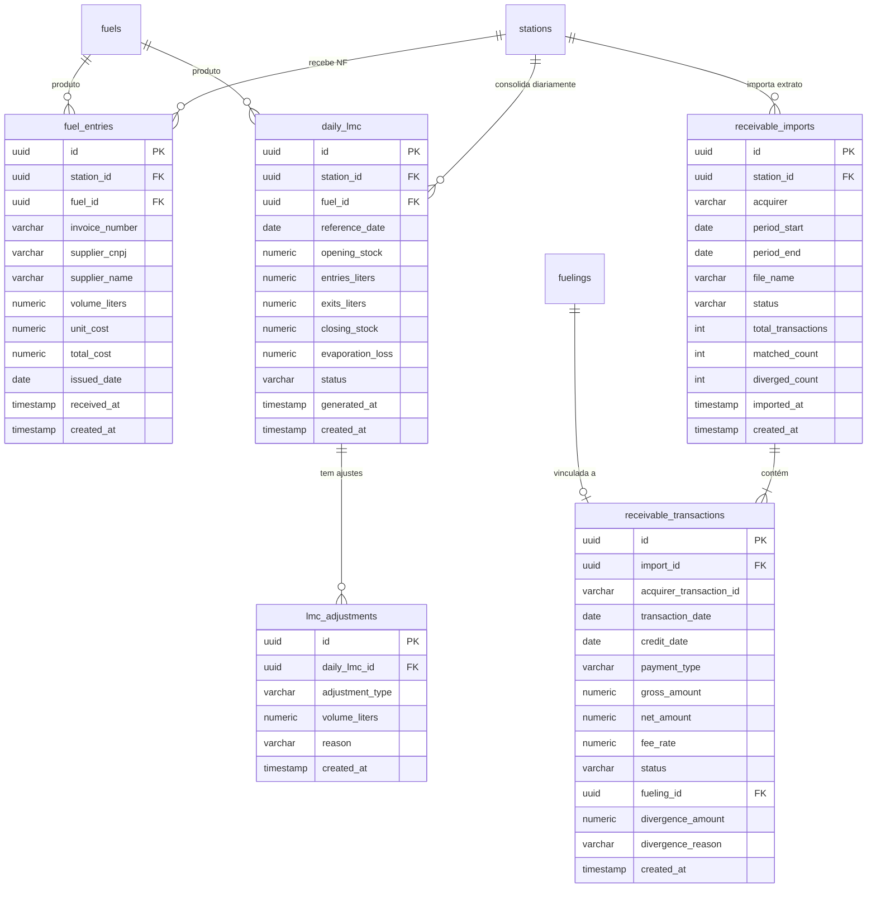

# Octane — Retaguarda ERP / Fiscal — Design

**Data:** 2026-06-14
**Status:** Rascunho para revisão

---

## 1. Visão Geral

### O que o módulo resolve

O módulo de Retaguarda cobre as obrigações fiscais e financeiras do posto de combustível que ficam além da pista: consolidação diária do estoque de combustível (LMC), escrituração fiscal (SPED), registro das entradas de combustível com nota fiscal e conciliação dos recebíveis eletrônicos.

Sem esse módulo o posto não tem como:

- Demonstrar para a ANP o estoque diário de cada produto (multa por ausência do LMC: R$ 5.000 a R$ 1.000.000, conforme Resolução ANP 884/2022, art. 55);
- Escriturar corretamente as entradas e saídas de combustível no SPED Fiscal (EFD-ICMS/IPI) para apuração do ICMS-ST;
- Conferir se as adquirentes (Cielo, Rede, Stone) creditaram exatamente o que foi vendido.

### Base legal

| Norma | O que exige |
|---|---|
| Resolução ANP 884/2022 | LMC eletrônico obrigatório; registro diário de estoque inicial, entradas, saídas por bomba e estoque final; guarda mínima de 6 meses |
| Convênio ICMS 110/2007 e legislação estadual | ICMS-ST sobre combustíveis; escrituração via EFD-ICMS/IPI |
| IN RFB 2.003/2021 | Leiaute SPED EFD-ICMS/IPI, blocos C, D e E |
| Lei 9.430/1996 / Res. BACEN 4.282/2013 | Conciliação de recebíveis de cartão; prazo máximo de crédito por modalidade |

### Posicionamento no roadmap

```
[pista + preços + cadastros] → [frontend operacional] → [retaguarda fiscal] → [autenticação] → [estoque avançado]
```

O módulo de retaguarda consome dados já existentes (`shift_reconciliations`, `fuelings`, `shifts`, `stations`) e adiciona três novos subdomínios: `lmc`, `fiscal` e `receivables`.

---

## 2. Modelo de Domínio

### 2.1 Diagrama de entidades



### 2.2 Relacionamento com o que já existe

| Entidade existente | Como é usada neste módulo |
|---|---|
| `shifts` | `daily_lmc` agrega `shift_reconciliations` de todos os turnos do dia para calcular `exits_liters` |
| `shift_reconciliations` | Saídas por bico → somadas por combustível → campo `exits_liters` do `daily_lmc` |
| `fuelings` | Vinculação com `receivable_transactions` para confrontar venda registrada vs. crédito da adquirente |
| `stations` | FK em todas as entidades novas; CNPJ do posto é usado na geração do SPED |
| `fuels` | FK em `fuel_entries` e `daily_lmc`; código de produto ANP necessário no LMC |

### 2.3 Enriquecimento necessário em entidades existentes

A entidade `fuels` precisa de dois campos novos para suportar LMC e SPED:

- `anp_product_code` (VARCHAR 10) — código do produto conforme tabela ANP (ex.: 500 = Gasolina Comum, 510 = Gasolina Aditivada, 300 = Diesel S-10)
- `ncm_code` (VARCHAR 8) — Nomenclatura Comum do Mercosul para o SPED (ex.: 27101259 para gasolina)

Migration: `V12__add_fiscal_codes_to_fuels.sql`.

---

## 3. Use Cases

### 3.1 Nota de Entrada de Combustível (`fuel_entries`)

#### `RegisterFuelEntryUseCase`

**Entrada:**

```java
public record RegisterFuelEntryRequest(
    UUID stationId,
    UUID fuelId,
    String invoiceNumber,      // NF-e: chave 44 dígitos ou número simples
    String supplierCnpj,       // CNPJ do fornecedor (distribuidora)
    String supplierName,
    BigDecimal volumeLiters,   // volume recebido em litros
    BigDecimal unitCost,       // custo por litro (R$/L)
    LocalDate issuedDate       // data de emissão da NF
)
```

**Regras de negócio:**

1. Posto deve existir e estar ativo.
2. Combustível deve existir e estar ativo.
3. `volumeLiters` > 0; `unitCost` > 0.
4. `invoiceNumber` não pode ser duplicado para o mesmo `supplierCnpj` no mesmo posto (evita duplo lançamento da mesma NF).
5. `issuedDate` não pode ser futura (nota ainda não emitida).
6. `totalCost` = `volumeLiters × unitCost` (2 casas, HALF_UP) — calculado internamente.
7. A entrada é vinculada automaticamente ao LMC do dia `issuedDate` (ou do dia de recebimento, se `issuedDate` for anterior ao dia corrente, usa `LocalDate.now()` como data de referência do LMC — conforme prática ANP).

**Saída:** `FuelEntryResponse` com todos os campos + `totalCost`.

#### `ListFuelEntriesUseCase`

Filtros: `stationId` (obrigatório), `fuelId` (opcional), `from`/`to` (datas de emissão), paginado (page/size, padrão 0/20).

### 3.2 LMC — Livro de Movimentação de Combustíveis

#### `GenerateDailyLmcUseCase`

Consolida o LMC de um dia para um combustível em um posto. Pode ser chamado manualmente pelo usuário ou via scheduler diário (00:15 do dia seguinte).

**Entrada:**

```java
public record GenerateDailyLmcRequest(
    UUID stationId,
    UUID fuelId,
    LocalDate referenceDate
)
```

**Algoritmo:**

```
estoque_inicial = closing_stock do LMC de (referenceDate - 1 dia)
                  ou ZERO se não houver registro anterior (primeiro dia)

entradas = Σ volume_liters de fuel_entries
           onde station_id = stationId
             AND fuel_id = fuelId
             AND DATE(received_at) = referenceDate  [1]

saidas = Σ measured_liters de shift_reconciliations
         JOIN shifts ON shift_reconciliations.shift_id = shifts.id
         JOIN nozzles ON shift_reconciliations.nozzle_id = nozzles.id
         JOIN pumps ON nozzles.pump_id = pumps.id
         WHERE pumps.station_id = stationId
           AND nozzles.fuel_id = fuelId
           AND DATE(shifts.closed_at) = referenceDate
           AND shifts.status = 'CLOSED'

ajustes = Σ volume_liters de lmc_adjustments
          onde daily_lmc_id = este LMC
          (positivo = entrada extra, negativo = saída extra)

evaporacao = Σ |volume| de lmc_adjustments do tipo EVAPORATION

estoque_final = estoque_inicial + entradas - saidas + ajustes

[1] data de referência do lançamento, não da emissão da NF
```

**Regras:**

1. `referenceDate` não pode ser futura.
2. Se já existir um LMC para (station, fuel, date) com status `FINAL`, rejeita nova geração (422: "LMC já finalizado para esta data").
3. Status `DRAFT` permite regeneração (sobrescreve).
4. Divergência de estoque (estoque_final negativo) não bloqueia — gera alerta `NEGATIVE_STOCK`.
5. Evaporação > 0,6% do estoque_inicial gera alerta `EVAPORATION_EXCEEDED`.

**Saída:** `DailyLmcResponse` com todos os campos + lista de alertas.

#### `FinalizeDailyLmcUseCase`

Muda status de `DRAFT` para `FINAL`. Após finalizar, o LMC não pode ser alterado (apenas registros de ajuste posterior com justificativa).

**Regra:** Não pode finalizar LMC com `closing_stock` negativo — exige registro de ajuste primeiro.

#### `RegisterLmcAdjustmentUseCase`

Registra perdas por evaporação, diferenças de medição de tanque, ou outras variações.

**Entrada:**

```java
public record RegisterLmcAdjustmentRequest(
    UUID dailyLmcId,
    String adjustmentType,   // EVAPORATION | MEASUREMENT_DIFF | OTHER
    BigDecimal volumeLiters, // positivo = entrada, negativo = saída
    String reason
)
```

**Regras:**

1. `EVAPORATION`: `|volumeLiters|` não pode exceder 0,6% do `opening_stock` do LMC. Se exceder → 422 com mensagem de limite ANP.
2. Não é permitido ajuste em LMC com status `FINAL` (LMC já enviado).
3. Após o ajuste, o LMC é regenerado automaticamente (mesmo use case de geração, mas preservando ajustes).

#### `ExportLmcUseCase`

Exporta o LMC em formato CSV conforme leiaute ANP 884/2022.

**Leiaute do CSV (campos por coluna):**

```
CNPJ_POSTO | DATA_REFERENCIA | COD_PRODUTO_ANP | ESTOQUE_INICIAL |
ENTRADAS | SAIDAS | AJUSTES | ESTOQUE_FINAL | STATUS
```

**Saída:** `byte[]` com conteúdo UTF-8 + BOM; nome sugerido: `LMC_{CNPJ}_{ANO}{MES}.csv`.

Exportação abrange um mês completo (todos os combustíveis, todos os dias com LMC gerado). Dias sem LMC (sem movimento) são incluídos com zeros se o período foi solicitado.

#### `GetDailyLmcUseCase`

Retorna o LMC de um dia específico (ou lista de um período) para um posto/combustível.

### 3.3 SPED Fiscal

#### `GenerateSpedFileUseCase`

Gera o arquivo EFD-ICMS/IPI de um período (geralmente mensal).

**Entrada:**

```java
public record GenerateSpedRequest(
    UUID stationId,
    YearMonth period
)
```

**Blocos gerados:**

| Bloco | Conteúdo |
|---|---|
| 0 (abertura) | Identificação do estabelecimento, período, dados do posto |
| C100/C170 | Documentos fiscais de entrada — NF-e de compra de combustível |
| C190 | Totais por CST/CFOP/alíquota das entradas |
| E110/E111 | Apuração do ICMS: débitos, créditos, diferencial de alíquota |
| 9 (encerramento) | Totais de registros por bloco |

**Decisão de design:** O SPED é gerado como arquivo texto (`.txt`) no padrão SPED com pipe `|` como delimitador. O sistema **não transmite** para a SEFAZ — apenas gera o arquivo para importação no PVA SPED (software da Receita Federal). Razão: integração direta com SEFAZ requer certificado digital A1/A3 e infraestrutura de assinatura, fora do escopo atual.

**Regras:**

1. Todos os `fuel_entries` do período com `invoiceNumber` preenchido são escriturados.
2. CFOP padrão para entrada de combustível: `1.653` (intraestadual) ou `2.653` (interestadual) — determinado pela UF do fornecedor vs. UF do posto.
3. CST ICMS: `010` (tributado e cobrado por ST, comum em combustíveis).
4. NCM do produto vem do campo `fuels.ncm_code`.
5. Arquivo gerado com encoding `ISO-8859-1` conforme especificação SPED.

**Saída:** `byte[]`; nome sugerido: `SPED_EFD_{CNPJ}_{ANO}{MES}.txt`.

### 3.4 Conciliação de Recebíveis

#### `ImportAcquirerStatementUseCase`

Importa o arquivo CSV de extrato de uma adquirente.

**Entrada:** `MultipartFile` + `stationId` + `acquirer` (enum: `CIELO | REDE | STONE`)

**Formato CSV simplificado (padrão interno — mesmo para as três adquirentes):**

```
transaction_id,transaction_date,credit_date,payment_type,gross_amount,net_amount,fee_rate
```

- `payment_type`: `CREDIT_1X | CREDIT_2X_12X | DEBIT | PIX`
- Separador: vírgula; encoding: UTF-8; primeira linha é cabeçalho.

**Processo:**

1. Parse e validação do CSV (linha inválida → registrada como erro, não aborta o import).
2. Cria registro `receivable_imports` com status `PROCESSING`.
3. Para cada transação: busca abastecimento correspondente em `fuelings` pela combinação (data, valor aproximado, forma de pagamento). Algoritmo de match:
   - `fuelings.fueled_at` dentro do mesmo dia da transação;
   - `fuelings.total_amount` dentro de R$ 0,05 de `gross_amount`;
   - `fuelings.payment_method` compatível com `payment_type`.
4. Se match encontrado → status `MATCHED`; se não → `UNMATCHED`.
5. Se match encontrado mas `net_amount` difere do esperado (calculado como `gross_amount × (1 - fee_rate)`) por mais de R$ 0,01 → `DIVERGED` com `divergence_reason = AMOUNT_MISMATCH`.
6. Atualiza `receivable_imports` com contagens e status `COMPLETED`.

**Saída:** `ReceivableImportResponse` com id, contagens e lista de transações divergentes.

#### `ListReceivableDivergencesUseCase`

Lista transações com status `UNMATCHED` ou `DIVERGED` de um import ou de um período, paginado.

#### `ResolveReceivableDivergenceUseCase`

Marca uma divergência como resolvida manualmente, com justificativa.

```java
public record ResolveDivergenceRequest(
    UUID transactionId,
    String resolution  // ex.: "Estorno creditado em 15/06", "Taxa negociada diferente"
)
```

---

## 4. API REST

Novo handler: `FiscalHandler` em `com.octane.fiscal.handler`.

### 4.1 Notas de Entrada de Combustível

| Método | Rota | Descrição | Status |
|---|---|---|---|
| POST | `/api/stations/{stationId}/fuel-entries` | Registrar NF de entrada | 201 |
| GET | `/api/stations/{stationId}/fuel-entries` | Listar entradas (filtros: fuelId, from, to, page, size) | 200 |
| GET | `/api/fuel-entries/{id}` | Detalhar uma entrada | 200 |

**Body POST:**

```json
{
  "fuelId": "uuid",
  "invoiceNumber": "35240612345678000195550010000012341234567890",
  "supplierCnpj": "12.345.678/0001-90",
  "supplierName": "Distribuidora Petro Ltda",
  "volumeLiters": 15000.000,
  "unitCost": 5.4320,
  "issuedDate": "2026-06-13"
}
```

**Response 201:**

```json
{
  "id": "uuid",
  "stationId": "uuid",
  "fuelId": "uuid",
  "fuelName": "Gasolina Comum",
  "invoiceNumber": "35240612...",
  "supplierCnpj": "12.345.678/0001-90",
  "supplierName": "Distribuidora Petro Ltda",
  "volumeLiters": 15000.000,
  "unitCost": 5.4320,
  "totalCost": 81480.00,
  "issuedDate": "2026-06-13",
  "receivedAt": "2026-06-14T08:30:00"
}
```

### 4.2 LMC

| Método | Rota | Descrição | Status |
|---|---|---|---|
| POST | `/api/stations/{stationId}/lmc/generate` | Gerar/regenerar LMC de um dia | 200 |
| POST | `/api/stations/{stationId}/lmc/{lmcId}/finalize` | Finalizar LMC (DRAFT → FINAL) | 200 |
| POST | `/api/stations/{stationId}/lmc/{lmcId}/adjustments` | Registrar ajuste | 201 |
| GET | `/api/stations/{stationId}/lmc` | Listar LMCs (filtros: fuelId, from, to, status) | 200 |
| GET | `/api/stations/{stationId}/lmc/{lmcId}` | Detalhar um LMC | 200 |
| GET | `/api/stations/{stationId}/lmc/export` | Exportar CSV mensal (query: year, month) | 200 (file download) |

**Body POST /generate:**

```json
{
  "fuelId": "uuid",
  "referenceDate": "2026-06-13"
}
```

**Response GET /lmc/{id}:**

```json
{
  "id": "uuid",
  "stationId": "uuid",
  "fuelId": "uuid",
  "fuelName": "Gasolina Comum",
  "anpProductCode": "500",
  "referenceDate": "2026-06-13",
  "openingStock": 12500.000,
  "entriesLiters": 15000.000,
  "exitsLiters": 8234.560,
  "evaporationLoss": 0.000,
  "closingStock": 19265.440,
  "status": "DRAFT",
  "alerts": [],
  "adjustments": [],
  "generatedAt": "2026-06-14T00:15:00"
}
```

**Export:** Content-Type `text/csv`, header `Content-Disposition: attachment; filename="LMC_12345678000195_202606.csv"`.

### 4.3 SPED

| Método | Rota | Descrição | Status |
|---|---|---|---|
| POST | `/api/stations/{stationId}/sped/generate` | Gerar arquivo SPED de um período | 200 (file download) |

**Body POST:**

```json
{
  "year": 2026,
  "month": 6
}
```

**Response:** Content-Type `application/octet-stream`, `Content-Disposition: attachment; filename="SPED_EFD_12345678000195_202606.txt"`.

### 4.4 Conciliação de Recebíveis

| Método | Rota | Descrição | Status |
|---|---|---|---|
| POST | `/api/stations/{stationId}/receivables/import` | Importar CSV de adquirente (multipart) | 202 |
| GET | `/api/stations/{stationId}/receivables/imports` | Listar imports (filtros: acquirer, from, to, status) | 200 |
| GET | `/api/receivables/imports/{importId}` | Detalhar import | 200 |
| GET | `/api/receivables/imports/{importId}/divergences` | Listar divergências do import | 200 |
| POST | `/api/receivables/transactions/{transactionId}/resolve` | Resolver divergência manualmente | 200 |

**Multipart POST /import:** campo `file` (CSV), query params `acquirer` (CIELO|REDE|STONE).

**Response 202 do import:**

```json
{
  "importId": "uuid",
  "status": "PROCESSING",
  "message": "Importação iniciada. Consulte o status pelo importId."
}
```

O processamento do CSV é síncrono para arquivos até 10.000 linhas. Acima disso retorna 202 e processa em background (futuro: job assíncrono). Decisão para MVP: síncrono; limite de 10.000 linhas por upload.

---

## 5. Migrações de Banco

### `V11__create_fuel_entries.sql`

```sql
CREATE TABLE fuel_entries (
    id UUID PRIMARY KEY DEFAULT gen_random_uuid(),
    station_id UUID NOT NULL REFERENCES stations(id),
    fuel_id UUID NOT NULL REFERENCES fuels(id),
    invoice_number VARCHAR(100) NOT NULL,
    supplier_cnpj VARCHAR(18) NOT NULL,
    supplier_name VARCHAR(150) NOT NULL,
    volume_liters NUMERIC(12,3) NOT NULL,
    unit_cost NUMERIC(10,4) NOT NULL,
    total_cost NUMERIC(14,2) NOT NULL,
    issued_date DATE NOT NULL,
    received_at TIMESTAMP NOT NULL DEFAULT NOW(),
    created_at TIMESTAMP NOT NULL DEFAULT NOW(),
    UNIQUE (station_id, supplier_cnpj, invoice_number)
);

CREATE INDEX idx_fuel_entries_station_date
    ON fuel_entries (station_id, fuel_id, received_at DESC);
```

### `V12__add_fiscal_codes_to_fuels.sql`

```sql
ALTER TABLE fuels
    ADD COLUMN anp_product_code VARCHAR(10),
    ADD COLUMN ncm_code VARCHAR(8);
```

Dados iniciais (via migration ou seed separado):

| Combustível | anp_product_code | ncm_code |
|---|---|---|
| Gasolina Comum | 500 | 27101259 |
| Gasolina Aditivada | 510 | 27101259 |
| Etanol | 320 | 22071000 |
| Diesel S-10 | 300 | 27101921 |
| Diesel S-500 | 301 | 27101921 |
| GNV | 130 | 27112100 |

### `V13__create_daily_lmc.sql`

```sql
CREATE TABLE daily_lmc (
    id UUID PRIMARY KEY DEFAULT gen_random_uuid(),
    station_id UUID NOT NULL REFERENCES stations(id),
    fuel_id UUID NOT NULL REFERENCES fuels(id),
    reference_date DATE NOT NULL,
    opening_stock NUMERIC(12,3) NOT NULL DEFAULT 0,
    entries_liters NUMERIC(12,3) NOT NULL DEFAULT 0,
    exits_liters NUMERIC(12,3) NOT NULL DEFAULT 0,
    evaporation_loss NUMERIC(12,3) NOT NULL DEFAULT 0,
    closing_stock NUMERIC(12,3) NOT NULL DEFAULT 0,
    status VARCHAR(10) NOT NULL DEFAULT 'DRAFT',  -- DRAFT | FINAL
    generated_at TIMESTAMP NOT NULL DEFAULT NOW(),
    created_at TIMESTAMP NOT NULL DEFAULT NOW(),
    UNIQUE (station_id, fuel_id, reference_date),
    CONSTRAINT chk_lmc_status CHECK (status IN ('DRAFT', 'FINAL'))
);

CREATE INDEX idx_daily_lmc_station_date
    ON daily_lmc (station_id, fuel_id, reference_date DESC);

CREATE TABLE lmc_adjustments (
    id UUID PRIMARY KEY DEFAULT gen_random_uuid(),
    daily_lmc_id UUID NOT NULL REFERENCES daily_lmc(id),
    adjustment_type VARCHAR(20) NOT NULL,  -- EVAPORATION | MEASUREMENT_DIFF | OTHER
    volume_liters NUMERIC(12,3) NOT NULL,
    reason VARCHAR(500) NOT NULL,
    created_at TIMESTAMP NOT NULL DEFAULT NOW(),
    CONSTRAINT chk_adjustment_type CHECK (
        adjustment_type IN ('EVAPORATION', 'MEASUREMENT_DIFF', 'OTHER')
    )
);
```

### `V14__create_receivables.sql`

```sql
CREATE TABLE receivable_imports (
    id UUID PRIMARY KEY DEFAULT gen_random_uuid(),
    station_id UUID NOT NULL REFERENCES stations(id),
    acquirer VARCHAR(20) NOT NULL,  -- CIELO | REDE | STONE
    period_start DATE NOT NULL,
    period_end DATE NOT NULL,
    file_name VARCHAR(255) NOT NULL,
    status VARCHAR(20) NOT NULL DEFAULT 'PROCESSING',  -- PROCESSING | COMPLETED | FAILED
    total_transactions INT NOT NULL DEFAULT 0,
    matched_count INT NOT NULL DEFAULT 0,
    diverged_count INT NOT NULL DEFAULT 0,
    imported_at TIMESTAMP NOT NULL DEFAULT NOW(),
    created_at TIMESTAMP NOT NULL DEFAULT NOW(),
    CONSTRAINT chk_acquirer CHECK (acquirer IN ('CIELO', 'REDE', 'STONE')),
    CONSTRAINT chk_import_status CHECK (status IN ('PROCESSING', 'COMPLETED', 'FAILED'))
);

CREATE TABLE receivable_transactions (
    id UUID PRIMARY KEY DEFAULT gen_random_uuid(),
    import_id UUID NOT NULL REFERENCES receivable_imports(id),
    acquirer_transaction_id VARCHAR(100) NOT NULL,
    transaction_date DATE NOT NULL,
    credit_date DATE NOT NULL,
    payment_type VARCHAR(30) NOT NULL,
    gross_amount NUMERIC(12,2) NOT NULL,
    net_amount NUMERIC(12,2) NOT NULL,
    fee_rate NUMERIC(6,4) NOT NULL,
    status VARCHAR(20) NOT NULL DEFAULT 'PENDING',  -- MATCHED | UNMATCHED | DIVERGED | RESOLVED
    fueling_id UUID REFERENCES fuelings(id),
    divergence_amount NUMERIC(12,2),
    divergence_reason VARCHAR(100),
    resolution_notes VARCHAR(500),
    resolved_at TIMESTAMP,
    created_at TIMESTAMP NOT NULL DEFAULT NOW(),
    CONSTRAINT chk_tx_status CHECK (status IN ('MATCHED', 'UNMATCHED', 'DIVERGED', 'RESOLVED'))
);

CREATE INDEX idx_receivable_tx_import
    ON receivable_transactions (import_id, status);

CREATE INDEX idx_receivable_tx_fueling
    ON receivable_transactions (fueling_id)
    WHERE fueling_id IS NOT NULL;
```

---

## 6. Frontend

### 6.1 Estrutura de navegação

A seção "Retaguarda" é adicionada ao menu lateral principal (atualmente: Pista, Preços, Cadastros, Histórico). Quatro sub-itens:

```
Retaguarda
├── Notas de Entrada
├── LMC
├── SPED Fiscal
└── Conciliação
```

### 6.2 Tela: Notas de Entrada

**Componentes:**
- `FuelEntryForm` — formulário de registro de NF com campos: combustível (select), número da NF, CNPJ do fornecedor, nome do fornecedor, volume (L), custo unitário (R$/L), data de emissão. Campo calculado (read-only): custo total.
- `FuelEntryList` — tabela paginada com filtros de período e combustível. Colunas: Data, NF, Fornecedor, Combustível, Volume (L), Custo Unit., Custo Total.
- `FuelEntryDetail` — modal ou drawer com todos os campos.

**Fluxo:** Usuário preenche formulário → sistema calcula custo total em tempo real (local, sem chamada API) → submit → POST → linha aparece na tabela.

### 6.3 Tela: LMC

**Componentes:**
- `LmcCalendar` — calendário mensal com célula por combustível por dia. Célula verde = FINAL, amarelo = DRAFT, cinza = sem geração, vermelho = alerta. Clique abre o detalhe.
- `LmcDetailPanel` — painel lateral com os números do dia: estoque inicial, entradas, saídas, ajustes, evaporação, estoque final. Botões: "Gerar/Regenerar", "Finalizar", "Adicionar Ajuste".
- `LmcAdjustmentModal` — modal para registro de ajuste: tipo, volume, justificativa.
- `LmcAlertBadge` — badge vermelho se `NEGATIVE_STOCK` ou `EVAPORATION_EXCEEDED`.
- `LmcExportButton` — seleciona mês → download do CSV.

**Fluxo principal:**
1. Usuário acessa LMC, seleciona mês.
2. Calendário mostra status de cada dia/combustível.
3. Clica em um dia → painel lateral mostra dados. Se não gerado → botão "Gerar".
4. Gerado com alertas → badge vermelho, usuário pode adicionar ajuste.
5. Sem alertas → botão "Finalizar" disponível.
6. Ao final do mês → "Exportar CSV" para envio à ANP.

### 6.4 Tela: SPED Fiscal

**Componentes:**
- `SpedGeneratorForm` — seleção de mês/ano + botão "Gerar e Baixar".
- `SpedPreviewInfo` — antes de gerar: mostra contagem de notas fiscais no período, avisos sobre campos faltantes (ex.: NCM não cadastrado no combustível).

**Fluxo:** Usuário seleciona mês → sistema mostra preview (quantas NFs, alertas de dados incompletos) → confirma → download do .txt.

### 6.5 Tela: Conciliação de Recebíveis

**Componentes:**
- `AcquirerImportUpload` — dropzone de arquivo CSV + select de adquirente + botão "Importar".
- `ImportHistoryList` — lista de imports com status, datas, contagens.
- `DivergenceTable` — tabela de transações com status `UNMATCHED` ou `DIVERGED`. Colunas: Data, Adquirente, Tipo Pgto, Valor Bruto, Valor Líquido, Status, Abastecimento Vinculado (se houver).
- `DivergenceResolutionModal` — campo de texto para justificativa + botão "Marcar como Resolvido".

**Fluxo:**
1. Usuário faz upload do extrato da adquirente.
2. Sistema processa e exibe resultado: X transações importadas, Y conciliadas, Z divergentes.
3. Tabela de divergências aparece. Para cada item: ver detalhes ou marcar como resolvido.

### 6.6 Convenções de frontend

- Todos os componentes novos seguem o padrão existente: hooks TanStack Query para fetch/mutação, tipos TypeScript definidos em `types/fiscal.ts`.
- Valores monetários formatados com `Intl.NumberFormat('pt-BR', { style: 'currency', currency: 'BRL' })`.
- Volumes em litros: 3 casas decimais, separador decimal vírgula.
- Datas: `dd/MM/yyyy` nas tabelas, campos de input tipo `date` nativos.
- Sem biblioteca de componentes nova — reutilizar os existentes no projeto.

---

## 7. Regras de Negócio Críticas

### 7.1 LMC — Tolerância de Evaporação (ANP 884/2022, art. 28)

```
Evaporação permitida = estoque_inicial × 0,006 (0,6%)
```

- Registro de ajuste tipo `EVAPORATION` com `|volume| > estoque_inicial × 0,006` → **erro 422** com mensagem: `"Volume de evaporação excede o limite ANP de 0,6% do estoque inicial (máximo: X litros)"`
- O sistema calcula e informa o máximo permitido na mensagem de erro.
- Para estoque inicial zero: limite = 0 litros (nenhuma evaporação registrável).

### 7.2 LMC — Estoque Negativo

- Estoque final negativo: LMC gerado com alerta `NEGATIVE_STOCK` mas não bloqueado.
- Finalização de LMC com estoque final negativo: **bloqueada** (422: "Estoque final negativo. Registre um ajuste antes de finalizar.").
- Rationale: estoque negativo indica erro de lançamento (entrada não registrada ou saída duplicada) — forçar correção antes de finalizar garante integridade.

### 7.3 LMC — Imutabilidade após Finalização

- LMC com status `FINAL` não pode ser regenerado, ajustado ou excluído.
- Se houver erro após finalização: registrar o LMC do dia seguinte com ajuste `MEASUREMENT_DIFF` e justificativa, corrigindo o saldo — prática aceita pela ANP.

### 7.4 Nota de Entrada — Idempotência

- Par `(supplier_cnpj, invoice_number)` único por posto → `UNIQUE (station_id, supplier_cnpj, invoice_number)`.
- Tentativa de duplicar a mesma NF → 409 Conflict: `"Nota fiscal já registrada para este fornecedor neste posto"`.

### 7.5 SPED — Integridade de campos obrigatórios

- Antes de gerar o SPED, valida se todos os combustíveis com entradas no período têm `anp_product_code` e `ncm_code` preenchidos.
- Se faltarem → 422 com lista dos combustíveis incompletos: `["Gasolina Comum: ncm_code ausente"]`.
- CFOP determinado por comparação de UF: `stations.state` vs. `fuel_entries.supplier_cnpj` (primeiros 8 dígitos → CNPJ → consulta CNPJ não é feita; UF do fornecedor é informada na NF, campo `supplier_state` adicionado a `fuel_entries`).

Ajuste: adicionar coluna `supplier_state CHAR(2) NOT NULL` à `fuel_entries` — incluído na migration V11.

### 7.6 Conciliação — Algoritmo de Match

A ordem de prioridade do match é:

1. Mesmo dia + valor dentro de R$ 0,05 + tipo de pagamento compatível → match único.
2. Mesmo dia + valor dentro de R$ 0,05 + tipo incompatível → `UNMATCHED` com reason `PAYMENT_TYPE_MISMATCH`.
3. Mesmo dia + valor fora de R$ 0,05 → `UNMATCHED` com reason `AMOUNT_NOT_FOUND`.
4. Dia diferente → `UNMATCHED` com reason `DATE_NOT_FOUND`.

Compatibilidade de forma de pagamento:

| `payment_type` (adquirente) | `payment_method` (fueling) |
|---|---|
| `CREDIT_1X` ou `CREDIT_2X_12X` | `CREDIT_CARD` |
| `DEBIT` | `DEBIT_CARD` |
| `PIX` | `PIX` |

### 7.7 Conciliação — Prazo de Crédito

Divergência de prazo: `credit_date` > data esperada conforme modalidade:

| Modalidade | Prazo esperado |
|---|---|
| Débito | D+1 útil |
| Crédito à vista | D+30 corridos |
| Crédito parcelado | D+30 por parcela |
| PIX | D+0 (mesmo dia) |

Prazo acima do esperado → alerta `CREDIT_DELAY` no `divergence_reason` (não impede match).

---

## 8. Estratégia de Testes

### 8.1 Testes unitários (por use case)

Cada use case deve ter testes cobrindo:

**`RegisterFuelEntryUseCase`**
- Registro bem-sucedido com cálculo correto de `totalCost`
- Posto inativo → 422
- NF duplicada → 409
- Data futura → 422
- Volume ou custo zero → 422

**`GenerateDailyLmcUseCase`**
- Primeiro dia (sem LMC anterior): opening_stock = 0
- Cálculo correto com entradas + saídas de múltiplos turnos fechados
- LMC já finalizado → 422
- Data futura → 422
- Regeneração de LMC em DRAFT preserva ajustes

**`RegisterLmcAdjustmentUseCase`**
- Evaporação dentro do limite (0,6%): sucesso
- Evaporação acima do limite: 422 com valor máximo calculado
- Ajuste em LMC FINAL: 422
- Evaporação com estoque inicial zero: 422 (máximo = 0)

**`FinalizeDailyLmcUseCase`**
- Estoque positivo: DRAFT → FINAL
- Estoque negativo: 422
- Já FINAL: 422

**`ExportLmcUseCase`**
- CSV gerado com cabeçalho correto
- Dias sem LMC incluídos com zeros
- Encoding UTF-8 com BOM

**`GenerateSpedFileUseCase`**
- Arquivo gerado com blocos 0, C, E, 9 na ordem correta
- Registro C100 por NF-e de entrada
- Combustível sem NCM → 422 antes de gerar
- CFOP correto: intraestadual vs. interestadual

**`ImportAcquirerStatementUseCase`**
- CSV válido com matches perfeitos → todos MATCHED
- Valor fora de tolerância → UNMATCHED com reason
- Linha de CSV malformada → erro registrado, processamento continua
- Fueling correspondente encontrado → fueling_id preenchido

**`ListReceivableDivergencesUseCase`**
- Filtro por status funciona
- Paginação correta

**`ResolveReceivableDivergenceUseCase`**
- Divergência UNMATCHED → RESOLVED com notes
- Transação já RESOLVED → 422

### 8.2 Testes de handler (camada REST)

- Status HTTP correto para cada cenário de sucesso e erro
- Validação de campos obrigatórios → 400
- Download de arquivo: Content-Type e Content-Disposition corretos
- Upload multipart: campo `file` ausente → 400

### 8.3 O que não testar nesta fase

- Integração com banco (repositórios): cobertos indiretamente pelos use cases via mocks
- Transmissão SPED para SEFAZ: fora do escopo
- Parsing de formatos reais das adquirentes (Cielo CNAB, OFX): o sistema usa formato CSV interno simplificado

---

## 9. Decisões de Design

### 9.1 Geração de SPED no backend vs. exportação para sistema externo

**Decisão:** Geração no backend do Octane.

**Trade-off:**

| Aspecto | Backend próprio | Sistema externo (ex.: TOTVS, Domínio) |
|---|---|---|
| Custo | Zero | Licença mensal (R$ 300–800/posto) |
| Manutenção | Segue mudanças do leiaute SPED internamente | Atualizado pelo fornecedor |
| Controle | Total | Limitado à integração disponível |
| Risco legal | Erro no leiaute = multa; precisa validar com PVA SPED | Risco transferido ao fornecedor |
| Tempo de implementação | Maior | Menor (integração via API/arquivo) |

**Rationale:** Para postos de pequeno porte (público-alvo do Octane), o custo de licença de sistema externo é relevante. O leiaute SPED é estável (IN 2.003/2021, poucas alterações). O risco de erro é mitigado pelo processo de validação no PVA SPED antes da entrega, que é responsabilidade do contador do posto.

### 9.2 Transmissão LMC via portal ANP vs. arquivo CSV

**Decisão:** Exportar arquivo CSV para importação manual no portal ANP.

**Rationale:** A ANP disponibiliza integração direta via webservice apenas para distribuidoras e postos de grande rede. Para postos individuais, o processo padrão é upload de arquivo no portal SCAP da ANP. Integração direta requer credencial de acesso da ANP — fora do escopo MVP.

### 9.3 LMC consolidado por turnos fechados vs. por abastecimentos individuais

**Decisão:** Usar `shift_reconciliations.measured_liters` (leitura de encerrante) como saídas do LMC, não a soma de `fuelings.liters`.

**Rationale:** A ANP exige que o LMC reflita a saída medida pelo encerrante da bomba, não os abastecimentos lançados no sistema. A diferença entre as duas grandezas é exatamente a divergência de turno que já está calculada em `shift_reconciliations.divergence_liters`. Usar o encerrante é mais fiel à realidade física do tanque e ao que a ANP espera.

### 9.4 Match de conciliação: busca por valor aproximado vs. ID de transação

**Decisão:** Busca por valor + data + forma de pagamento (fuzzy match), sem vínculo por ID externo.

**Rationale:** As adquirentes não incluem identificador do PDV no extrato (somente o ID interno da adquirente). O abastecimento no Octane não armazena o código de autorização da maquininha (fora do escopo da pista). O fuzzy match com tolerância de R$ 0,05 é a abordagem padrão de conciliação no varejo. Falsos positivos são tratados pelo operador via `ResolveReceivableDivergenceUseCase`.

### 9.5 Estrutura de pacotes — módulo `fiscal` separado vs. expandir `fueling`

**Decisão:** Novo pacote `com.octane.fiscal` com subpacotes `lmc`, `entry` e `receivables`.

```
com.octane.fiscal
├── entry
│   ├── domain
│   │   ├── FuelEntry.java
│   │   └── repository/FuelEntryRepository.java
│   ├── usecase
│   │   ├── RegisterFuelEntryUseCase.java
│   │   ├── RegisterFuelEntryRequest.java
│   │   ├── FuelEntryResponse.java
│   │   └── ListFuelEntriesUseCase.java
│   └── (sem handler próprio — integrado ao FiscalHandler)
├── lmc
│   ├── domain
│   │   ├── DailyLmc.java
│   │   ├── LmcAdjustment.java
│   │   ├── LmcStatus.java
│   │   ├── AdjustmentType.java
│   │   └── repository/
│   │       ├── DailyLmcRepository.java
│   │       └── LmcAdjustmentRepository.java
│   └── usecase
│       ├── GenerateDailyLmcUseCase.java
│       ├── FinalizeDailyLmcUseCase.java
│       ├── RegisterLmcAdjustmentUseCase.java
│       ├── ExportLmcUseCase.java
│       └── GetDailyLmcUseCase.java
├── receivables
│   ├── domain
│   │   ├── ReceivableImport.java
│   │   ├── ReceivableTransaction.java
│   │   ├── Acquirer.java
│   │   └── repository/
│   └── usecase
│       ├── ImportAcquirerStatementUseCase.java
│       ├── ListReceivableDivergencesUseCase.java
│       └── ResolveReceivableDivergenceUseCase.java
├── sped
│   └── usecase
│       └── GenerateSpedFileUseCase.java
└── handler
    └── FiscalHandler.java
```

**Rationale:** O módulo fiscal é autônomo e cresce por sua própria dinâmica regulatória. Misturar com `fueling` violaria o princípio de coesão e dificultaria o isolamento de testes. O `FiscalHandler` único centraliza os endpoints de retaguarda sem dispersão de handlers.

### 9.6 Scheduler para geração automática do LMC

**Decisão:** Implementar scheduler Spring (`@Scheduled`) que roda às 00:15 de cada dia e gera o LMC de todos os combustíveis do dia anterior para todos os postos ativos.

**Restrição:** O scheduler só gera LMCs com status `DRAFT` — nunca sobrescreve `FINAL`. O usuário ainda pode regenerar manualmente. Log de execução gravado; falha em um posto não afeta os demais (try-catch por posto).

**Trade-off:** Alternativa seria geração lazy (apenas quando o usuário acessa a tela). O scheduler garante que o LMC esteja disponível para revisão logo de manhã, sem depender de ação do usuário — mais adequado para o contexto de compliance diário.

---

## 10. Riscos e Pontos de Atenção

| Risco | Probabilidade | Impacto | Mitigação |
|---|---|---|---|
| Mudança no leiaute SPED pela RFB | Média | Alto | Isolar lógica de geração em classe `SpedFileBuilder` facilmente substituível |
| Mudança no formato CSV das adquirentes | Alta (Stone já mudou 2x em 2025) | Médio | Parser por adquirente em estratégias separadas (`CieloParser`, `RedeParser`, `StoneParser`) mesmo que o formato interno seja uniforme |
| Turno fechado no dia seguinte ao movimento | Média | Alto | `measured_liters` do LMC considera `DATE(shifts.closed_at)`, não `DATE(shifts.opened_at)` — turnos noturnos que fecham depois da meia-noite são contabilizados no dia do fechamento (comportamento ANP) |
| Estoque inicial do primeiro LMC | Certa (setup) | Médio | UI permite edição manual do `opening_stock` do primeiro LMC (campo desbloqueado apenas quando não há LMC anterior) |
| Volume grande de transações de conciliação | Baixa (posto médio: ~200 transações/dia) | Baixo | Limite de 10.000 linhas por upload cobre ~50 dias; processamento síncrono adequado |
| NCM/código ANP desatualizado | Baixa | Médio | Campos editáveis em `fuels` via `PATCH /api/fuels/{id}`; validação antes de gerar SPED alerta o usuário |

---

## 11. Ordem Sugerida de Implementação

1. **V11-V14 migrations** — banco antes de tudo.
2. **V12 + seed de códigos fiscais** — enriquecer tabela `fuels`.
3. **`RegisterFuelEntryUseCase` + endpoint** — base para o LMC e o SPED.
4. **`GenerateDailyLmcUseCase` + `GetDailyLmcUseCase`** — núcleo do LMC.
5. **`RegisterLmcAdjustmentUseCase` + `FinalizeDailyLmcUseCase`** — completar ciclo LMC.
6. **`ExportLmcUseCase`** — entrega imediata de valor fiscal.
7. **Scheduler LMC** — automação.
8. **`GenerateSpedFileUseCase`** — SPED.
9. **`ImportAcquirerStatementUseCase` + divergências** — conciliação.
10. **Frontend** — telas na ordem: Notas de Entrada → LMC → Conciliação → SPED.
